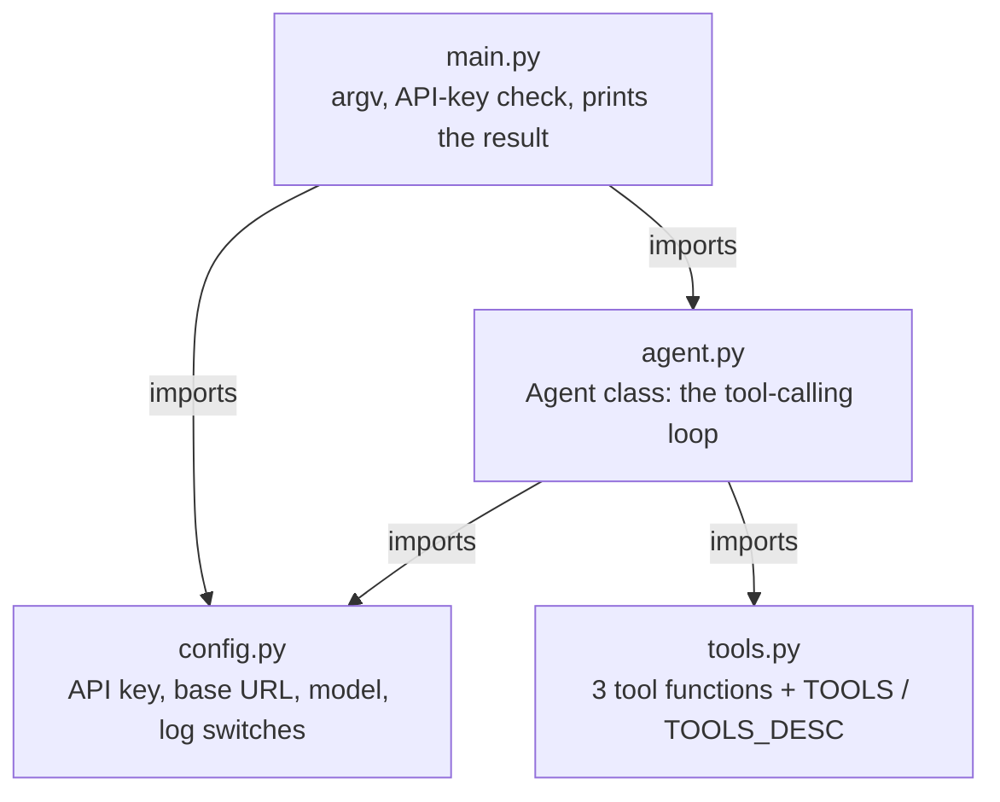
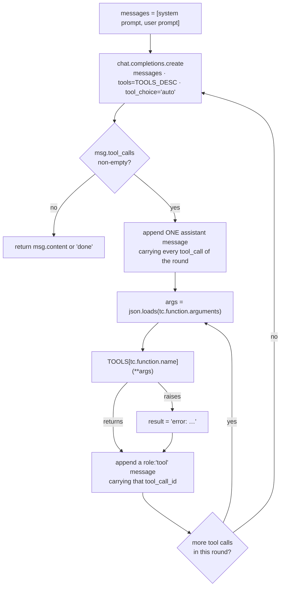

# Bare Agent

The simplest possible agent: one tool-calling loop over an LLM, with three tools
(read a file, write a file, run a shell command). No framework, no build step, no
dependencies beyond the OpenAI SDK — a few hundred lines you can read end to end.

It is the first entry in the `mini-agent-system/` series, meant as a starting point
you copy and grow rather than a library you import.

## Structure

Four modules, no package, no shared state. `main.py` is the only entry point, and
`agent.py` is the only module that talks to the model:



`config.py` and `tools.py` are leaves — they import only the standard library and
nothing from this project, so neither can reach back into the agent. `agent.py` is
the only file that knows about both the model and the tools, which makes it the
one to read first.

The program only runs correctly from inside this directory. See
[Layout](#layout) below for the file-by-file listing.

### What one round does

`Agent.run()` (`agent.py:20`) is a `while True` whose only exit is a response
carrying no tool calls:



Three properties of that picture are easy to break when editing, and all three are
load-bearing:

- The assistant message is appended **once per round**, outside the per-call loop,
  carrying all of that round's `tool_calls`. The `role: "tool"` replies follow, one
  per call, in the same order. The API rejects any other shape.
- Only the `try` around `TOOLS[...]` is protected. `json.loads` sits *outside* it
  (`agent.py:106`), so a tool that raises becomes an `error: …` observation the
  model can react to, while arguments the model emits as invalid JSON take the
  whole process down instead.
- Nothing else terminates the run — no round counter, no budget, no timeout. A
  model that keeps calling tools keeps the process alive, and every pass through
  `Call` is a billable request. See [Limitations](#limitations).

## Requirements

- Python 3.x — developed on 3.14.7 (miniconda base)
- `openai` installed (`pip install openai`) — currently 3.17.0, installed globally
  rather than pinned, so version drift is possible
- An API key for a DeepSeek-compatible endpoint

## Setup

Credentials come from the environment; every variable has a fallback, but the
default key is a placeholder:

| Variable | Default |
| --- | --- |
| `DEEPSEEK_API_KEY` | `sk-your-key-here` |
| `DEEPSEEK_BASE_URL` | `https://api.deepseek.com` |
| `DEEPSEEK_MODEL_NAME` | `deepseek-flash` |

```bash
export DEEPSEEK_API_KEY=sk-...
```

The program exits immediately if the key is still the placeholder.

## Running

Run from this directory:

```bash
cd 01-bare-agent
python3 main.py 'write a short poem about the sea'
python3 main.py 'create tmp/hello.py that prints hello, then run it'
```

The prompt is a single command-line argument, so quote it. All you see on stdout is
the prompt echoed back and the final answer — the tool calls in between are visible
only in `logs/deepseek_api.log`.

## How it works

`Agent.run()` in `agent.py:20` is the whole agent:

1. Seed `messages` with a hardcoded system prompt (`agent.py:31`) and the user prompt.
2. Call `chat.completions.create(..., tools=TOOLS_DESC, tool_choice="auto")`.
3. **No tool calls** → return the message content; the loop ends.
4. **Tool calls** → append the assistant message, execute each tool by looking its
   name up in the `TOOLS` dict, append each result as a `role: "tool"` message, and
   repeat from step 2.

The model sees tool results as ordinary messages, so it decides on its own whether
to call another tool or produce a final answer. A tool that raises is caught and
handed back as the string `error: {e}` (`agent.py:104`) instead of crashing the
run — the model can then retry with different arguments.

## Tools

Three tools are defined in `tools.py`:

| Tool | What it does |
| --- | --- |
| `read_file(path)` | Return a file's contents |
| `write_file(path, content)` | Write a file, creating parent directories as needed |
| `execute_command(command)` | Run a shell command, return stdout + stderr (30s timeout) |

Tools are registered in two parallel structures and **both must be updated
together** when you add one:

- `TOOLS` (`tools.py:50`) — name → callable, used for dispatch.
- `TOOLS_DESC` (`tools.py:56`) — OpenAI function schema, sent to the model.

Adding a Python function alone does nothing. Omitting the `TOOLS` entry yields a
`KeyError` that surfaces to the model as a spurious error; omitting the `TOOLS_DESC`
entry makes the tool invisible and uncallable.

## Logging

`logs/deepseek_api.log` is the only run record — there are no tests and no commit
history. `EXPORT_LOG` gates logging globally and `EXPORT_LOG_CHOICES`
(`config.py:12`) gates each section individually; both must be true for a section
to appear. By default the message dumps are on and the raw API payloads are off.

Two things to know before reading a log:

- The `initial-messages` block opens the file with `"w"`, so **each run truncates
  the log** — it only ever holds the most recent run.
- Every enabled section re-dumps the *entire* message history, so the file grows
  fast and the last section of a round repeats everything before it. Grep for the
  section headers to navigate: `Round N`, `Messages at the beginning:`,
  `Message in LLM response:`, `Messages after tool execution:`.

## Limitations

This is a teaching example, not a safe or complete agent:

- **No iteration cap.** The `while True` at `agent.py:43` never stops on its own.
  A model that keeps calling tools loops forever, and every round is a billable
  API call.
- **No sandboxing.** `read_file` and `write_file` touch any path the process can
  reach, and `execute_command` runs `subprocess.run(..., shell=True)` — it will
  happily run `rm -rf`. Run it somewhere you don't mind losing.
- **No memory.** Each `python3 main.py` starts a fresh conversation; nothing
  persists between runs.
- **No streaming, no retries, no token accounting.**

## Layout

```
main.py      entry point: argv parsing, key check, calls Agent().run()
agent.py     the agent loop
tools.py     tool implementations + the two registration structures
config.py    credentials, model, and logging switches
```
