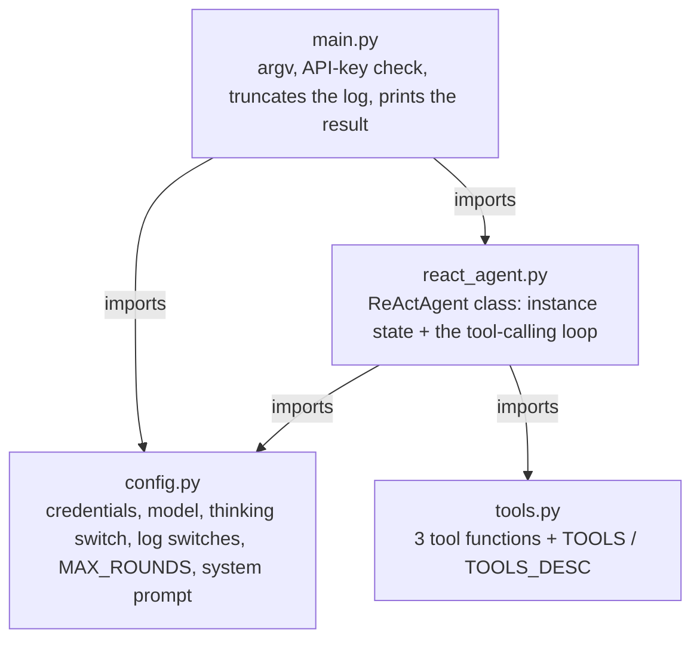
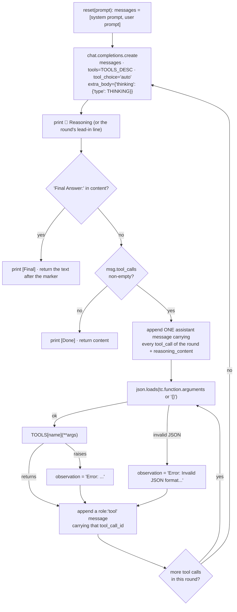

# ReAct Agent

The second entry in the `mini-agent-system/` series: the same three-tool calling
loop as [`../01-bare-agent/`](../01-bare-agent/), but with a ReAct-style system
prompt, a round cap, and DeepSeek's thinking channel wired into the request and the
message history. No framework, no build step, no dependency manifest, no tests — a
few hundred lines you can read end to end.

It is the next step after `01-bare-agent` rather than a replacement: read 01 first
if you haven't, then read [Differences from 01-bare-agent](#differences-from-01-bare-agent)
for what actually changed and why.

## Structure

Four modules, no package. `main.py` is the only entry point, and `react_agent.py` is
the only module that talks to the model:



`config.py` and `tools.py` are leaves — they import only the standard library and
nothing from this project, so neither can reach back into the agent. `react_agent.py`
is the only file that knows about both the model and the tools, which makes it the
one to read first.

### What one round does

`ReActAgent.run()` (`react_agent.py:42`) is a `while round < max_rounds` with two
normal exits: a `Final Answer:` marker, or a response carrying no tool calls.



Four properties of that picture are easy to break when editing:

- The assistant message is appended **once per round**, outside the per-call loop
  (`react_agent.py:154-172`), carrying all of that round's `tool_calls`. The
  `role: "tool"` replies follow, one per call, in the same order. The API rejects any
  other shape. This is also the shape any future context compression has to cut
  along — whole `(assistant + its tool results)` groups, never a slice of one.
- **`reasoning_content` must be echoed back**, because every request here sends
  `tools`. See [Thinking mode](#thinking-mode) — it is the one rule in this file that
  produces intermittent `400`s rather than an obvious failure when you get it wrong.
- There are two independent `try` blocks: one around `json.loads` (`react_agent.py:178`)
  and one around `TOOLS[...]` (`react_agent.py:186`). Both recover by handing the
  failure back to the model as an `Error: ...` observation. But the `👁 Observation:`
  print at `react_agent.py:191` sits outside both, and slices the raw return value
  (`observation[:200]`) before `str()` is applied — a tool returning `None` or an
  `int` raises `TypeError` straight out of `run()`.
- `MAX_ROUNDS` is the only stop that isn't the model's own choice. Exhausting it
  returns the literal string `"Max steps reached"` (`react_agent.py:211`), which a
  caller that only prints the result cannot tell apart from a real answer.

## Requirements

- Python 3.x — developed on 3.14.7 (miniconda base)
- `openai` installed (`pip install openai`) — currently 3.17.0, installed globally
  rather than pinned, so version drift is possible
- An API key for a DeepSeek-compatible endpoint, with a model that supports the
  thinking channel described below

## Setup

Credentials come from the environment; every variable has a fallback, but the
default key is a placeholder:

| Variable | Default |
| --- | --- |
| `DEEPSEEK_API_KEY` | `sk-your-key-here` |
| `DEEPSEEK_BASE_URL` | `https://api.deepseek.com` |
| `DEEPSEEK_MODEL_NAME` | `deepseek-flash` |
| `DEEPSEEK_THINKING` | `enabled` — `"enabled"` or `"disabled"` |

```bash
export DEEPSEEK_API_KEY=sk-...
```

The program exits immediately if the key is still the placeholder.

## Running

Run from this directory:

```bash
cd 02-react-agent
python3 main.py 'what is the story in tmp/ about?'
python3 main.py 'create tmp/hello.py that prints hello, then run it'
```

The prompt is a single command-line argument, so quote it. Unlike 01, stdout now
narrates the loop as it goes — `--- Round N ---`, `💭 Reasoning`, `🔧 Action`,
`👁 Observation` (truncated to 200 chars), `[Final]` / `[Done]` — with the full,
untruncated history only in `logs/deepseek_api.log`. Treat the log, not the
decorations, as the record of what happened: the `🤔 Thought:` line is parsed out of
`content` and simply doesn't print when the model doesn't emit the marker.

## How it works

`ReActAgent` holds the conversation as instance state — `self.messages`,
`self.system_prompt`, and a `self.plan` placeholder — and `reset(prompt)`
(`react_agent.py:29`) re-seeds it with the system prompt plus the user prompt.
`run()` in `react_agent.py:42` is the whole agent:

1. `reset(prompt)` seeds `messages` from `self.system_prompt` (`config.py:29`, the
   ReAct format instructions) and the user prompt.
2. Call `chat.completions.create(..., tools=TOOLS_DESC, tool_choice="auto")`, with
   thinking passed inside `extra_body`.
3. **`"Final Answer:"` in content** → return the text after the marker; the loop ends.
4. **No tool calls** → return the content; the loop ends.
5. **Tool calls** → append the assistant message, execute each tool by looking its
   name up in the `TOOLS` dict, append each result as a `role: "tool"` message, and
   repeat from step 2 — until `MAX_ROUNDS` is exhausted.

The model sees tool results as ordinary messages, so it decides on its own whether
to call another tool or produce a final answer. A tool that raises, an unknown tool
name, and arguments the model emits as invalid JSON are all caught and handed back
as an `Error: ...` observation (`react_agent.py:178-189`) instead of crashing the
run. Nothing propagates, so a bad round is recoverable — and invisible unless you
read the log.

## Thinking mode

`DEEPSEEK_THINKING` defaults to `enabled`, and `deepseek-flash` is a thinking model,
so this is the default path through the code. It changes more than latency:

- **The response carries `reasoning_content`, and history must echo it back.** Because
  every request here sends `tools`, DeepSeek rejects the *next* request with
  `400 ... The reasoning_content in the thinking mode must be passed back to the API`
  unless every historical assistant message still carries its `reasoning_content` —
  including the empty string, which is why the test is `is not None`
  (`react_agent.py:167-171`) rather than a truthiness check. The rule is keyed on the
  request carrying `tools`, not on that turn having called a tool. It is also
  *conditional* upstream, so violations show up as intermittent `400`s.
- **The chain of thought goes into `reasoning_content`, leaving `content` empty** or
  a one-line lead-in. That is what the `💭 Reasoning:` / `💭 Lead-in:` lines are
  parsing: the former for a thinking response, the latter as a fallback for a plain
  chat model.
- **Turning thinking off does not restore ReAct format compliance.** The prompt is
  the only thing asking for `Thought:` / `Action:` / `Final Answer:`; nothing enforces
  it. Format compliance varies run to run either way, so `🤔 Thought:` prints
  sporadically at best. Expect a thinking run that calls tools for 20 rounds with
  almost no visible text.

Set `DEEPSEEK_THINKING=disabled` to compare against a plain chat model; note that
thinking mode also ignores `temperature`, `presence_penalty` and
`frequency_penalty`, and floors `top_p` at 0.95.

## Tools

Three tools are defined in `tools.py`:

| Tool | What it does |
| --- | --- |
| `read_file(path)` | Return a file's contents |
| `write_file(path, content)` | Write a file, creating parent directories as needed |
| `execute_command(command)` | Run a shell command, return stdout + stderr (30s timeout) |

Tools are registered in two parallel structures and **both must be updated
together** when you add one:

- `TOOLS` (`tools.py:50`) — name → callable, used for dispatch.
- `TOOLS_DESC` (`tools.py:56`) — OpenAI function schema, sent to the model.

Adding a Python function alone does nothing. Omitting the `TOOLS` entry yields a
`KeyError` that surfaces to the model as a spurious error; omitting the `TOOLS_DESC`
entry makes the tool invisible and uncallable.

`tools.py` is byte-for-byte identical to `../01-bare-agent/tools.py` — there is
nothing ReAct-specific about the tools, and every roadmap feature that adds one
(memory ×2, planner, delegate) means editing both copies.

## Logging

`logs/deepseek_api.log` is the only run record — there are no tests and no commit
history. `EXPORT_LOG` gates logging globally and `EXPORT_LOG_CHOICES`
(`config.py:13`) gates each section individually; both must be true for a section to
appear. By default the message dumps are on and the raw API payloads are off.

Three things to know before reading a log:

- `main.py:26-32` truncates the file **unconditionally** whenever `EXPORT_LOG` is on,
  not by the `initial-messages` choice (which is off). Each run holds only the most
  recent run — copy a log out before re-running if it is worth keeping.
- Every enabled section re-dumps the *entire* message history, so the file grows as
  rounds × history (a 17-round run measured 3.3 MB) and the last section of a round
  repeats everything before it.
- The `llm-response-message` dumps include provider-specific fields
  (`reasoning_content`, `annotations`), so the log format is not portable across
  backends.

Grep the section headers to navigate: `Round N`, `Messages at the beginning:`,
`Message in LLM response:`, `Content in LLM response message:`,
`Messages after tool execution:`.

## Differences from 01-bare-agent

Same tools, same loop skeleton, same logging idea. What changed:

| | 01-bare-agent | 02-react-agent |
| --- | --- | --- |
| Loop termination | `while True` — unbounded | `while round < MAX_ROUNDS` (30), then returns `"Max steps reached"` |
| System prompt | Hardcoded one-liner inside `run()` | `config.DEFAULT_SYSTEM_PROMPT`, ReAct format, injectable per instance |
| Conversation state | Local `messages` variable, discarded on exit | `self.messages` / `self.system_prompt` / `self.plan` + `reset()` |
| Success protocol | Implicit: the model stops calling tools | Explicit: `"Final Answer:"` in `content`, checked before the no-tool-calls branch |
| Return on empty content | `msg.content or "done"` | `content`, which can be `""` |
| Thinking mode | Not passed at all | `extra_body={"thinking": ...}` + `reasoning_content` echoed into history |
| Invalid JSON arguments | `json.loads` outside any `try` → kills the run | Becomes an `Error: ...` observation |
| Zero-argument tool call | `json.loads("")` raises | `tc.function.arguments or "{}"` |
| Tool error string | `error: {e}` | `Error: {e}` |
| stdout during the loop | Nothing until the final answer | Per-round Reasoning / Thought / Action / Observation / `[Final]` / `[Done]` |
| Log truncation | Only when `initial-messages` is enabled | Unconditional whenever `EXPORT_LOG` is on |
| Log sections | 6 keys, including `messages-after-llm-response-before-tool-execution` | 8 keys: that one dropped, `llm-response-message-content` / `final-answer` / `thought` added |
| `tools.py` | — | Byte-for-byte identical |
| Indentation | 4 spaces | Tabs |

Four of those are substantive:

**Instance state.** 01's `messages` lives and dies inside `run()`; the `Agent` object
is stateless. Moving it onto the instance is what makes memory, mid-task prompt
changes, and retries even expressible — `self.plan` is an unused placeholder reserved
for the planner stage. This is the change everything else builds on.

**A bounded loop.** 01 runs until the model chooses to stop; a model that keeps
calling tools keeps the process alive and keeps billing. 02 caps at 30 rounds. The
cap is honest about its own failure mode, though — see Limitations.

**An explicit success protocol.** With a format marker in the system prompt and a
check for it before the no-tool-calls branch, "the task is done" becomes something
the model states rather than something inferred from silence.

**The thinking channel.** Two half-changes, not one: the request opts in via
`extra_body`, and the history echoes `reasoning_content` back. Do one without the
other and you either get no chain of thought or a `400` on the second request. 01
skips thinking entirely, which is why it never has to deal with this.

If 01 and 02 look closer than you expected in the [Structure](#structure) diagram:
yes, they are the same skeleton. The assistant-message construction, in particular,
is **not** a difference — both now build it once per round, outside the per-call
loop. Earlier notes in this series claimed 02 fixed that; 01 was edited to match.

Two places 02 is not an improvement:

- The `observation[:200]` print (`react_agent.py:191`) is a crash point 01 simply
  doesn't have, because 01 prints nothing during the loop.
- `"Max steps reached"` is a string, not an error, so a caller can't distinguish
  exhaustion from an answer. 01's failure mode is different rather than better: it
  just never returns.

Neither lesson manages context. History only grows; `MAX_ROUNDS` is the only thing
standing between a confused model and a very large request. That is the next stage
in the roadmap.

## Limitations

This is a teaching example, not a safe or complete agent:

- **The round cap is a band-aid, not a fix.** `MAX_ROUNDS = 30` (`config.py:27`)
  bounds a runaway loop, but 30 rounds of a growing history is already an expensive
  request, and the cap reports itself as `"Max steps reached"` — indistinguishable
  from an answer.
- **No context management.** `self.messages` is never trimmed, summarized, or
  compacted. Long tasks grow the prompt monotonically.
- **No sandboxing.** `read_file` and `write_file` touch any path the process can
  reach, and `execute_command` runs `subprocess.run(..., shell=True)` — it will
  happily run `rm -rf`. Run it somewhere you don't mind losing.
- **No memory.** Each `python3 main.py` starts a fresh conversation; `self.messages`
  is per-instance and the instance is per-process.
- **No streaming, no retries, no token accounting, no tests.**
- **The ReAct format is prompt-only.** Nothing enforces `Thought:`; the display code
  parses it when it appears and stays quiet when it doesn't.

## Layout

```
main.py          entry point: argv parsing, key check, log truncation, calls ReActAgent().run()
react_agent.py   the ReActAgent class: instance state, the loop, the display, the logging
tools.py         tool implementations + the two registration structures
config.py        credentials, model, thinking switch, log switches, MAX_ROUNDS, system prompt
```
