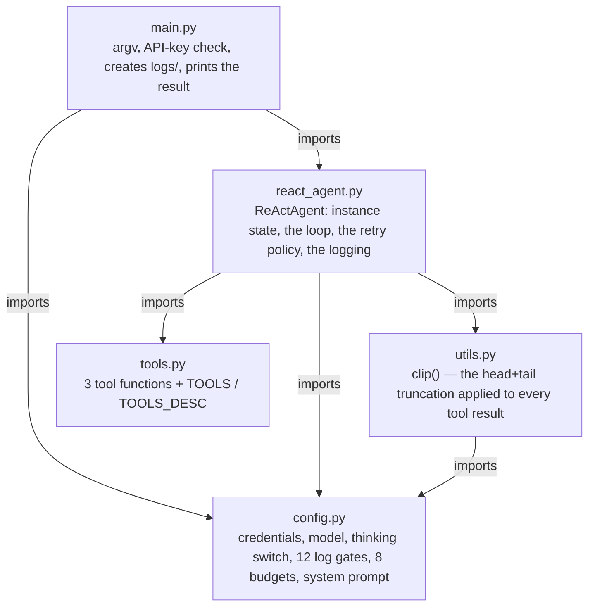
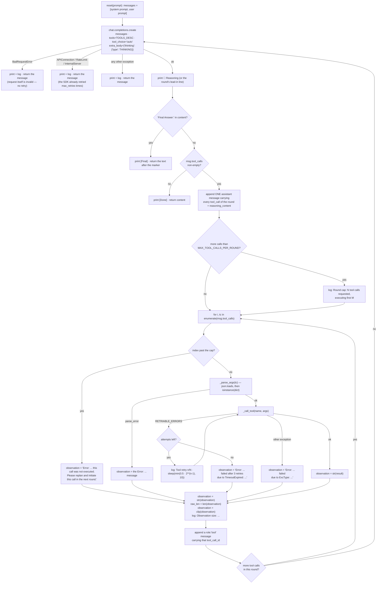

# Error-Handling ReAct Agent

The third entry in the `mini-agent-system/` series: the same three-tool ReAct loop as
[`../02-react-agent/`](../02-react-agent/), plus the part that decides what happens when
things go wrong — a parser that checks the model's arguments before they reach a tool, a
retry for failures worth retrying, an immediate flat refusal for failures that are not,
and budgets on all three axes a run can grow along. No framework, no build step, no
dependency manifest — a few hundred lines you can read end to end.

It is the next step after `02-react-agent` rather than a replacement: the loop skeleton,
the system prompt, the thinking channel and the tools are unchanged. Read 02 first if you
haven't, then read [Differences from 02-react-agent](#differences-from-02-react-agent)
for what actually changed and why.

The lesson's whole point is one split:

| Failure | Examples | Who fixes it | How |
| --- | --- | --- | --- |
| **Deterministic** | `FileNotFoundError`, missing or malformed arguments, unknown tool name, `400` | the model | hand back `Error: ...`, once, immediately |
| **Transient** | `subprocess.TimeoutExpired`, `ConnectionError`, `TimeoutError`, `429` and `5xx` | the code | bounded retries with exponential backoff |

Retrying a deterministic error does not just waste money — it delays the feedback the
model needs in order to correct its own call.

## Structure

Five modules, no package. `main.py` is the only entry point; `react_agent.py` is the only
module that talks to the model:



`tools.py` and `config.py` are still leaves, but they are no longer the whole floor:
`utils.py` imports `MAX_OBS_CHARS` from `config.py`, so `react_agent.py` now has three
dependencies instead of two. `utils.py` exists because `clip()` is the one piece of the
agent that is genuinely separable from the loop — it takes a string and returns a string,
with no idea what a message history is.

### What one round does

`ReActAgent.run()` (`react_agent.py:113`) is a `while round < max_rounds` with two normal
exits (a `Final Answer:` marker, or a response carrying no tool calls) and four failure
exits that all return a string. Every path that used to raise now returns.



Four properties of that picture are easy to break when editing:

- The assistant message is appended **once per round**, outside the per-call loop
  (`react_agent.py:267-285`), carrying all of that round's `tool_calls`. The
  `role: "tool"` replies follow, one per call, in the same order. **A refused call still
  gets a reply** — the cap is expressed as a tool result, not by trimming
  `msg.tool_calls`. Trimming would make the transcript stop matching what the model
  actually said, and the assistant message's `reasoning_content` may still refer to the
  calls that were dropped. The API rejects any other shape.
- **`reasoning_content` must be echoed back**, because every request here sends `tools`.
  See [Thinking mode](#thinking-mode) — it is the one rule in this file that produces
  intermittent `400`s rather than an obvious failure when you get it wrong. Note the
  consequence for this lesson specifically: a retry wrapper that swallowed `400`s would
  turn that into an invisible correctness bug. That is why `BadRequestError` is handled
  *outside* `_call_tool`, in the API layer, and returns rather than retries.
- **The observation path is safe by construction.** `_call_tool` returns `str(...)` at
  the tool boundary (`react_agent.py:95`), the call site re-applies it
  (`react_agent.py:320`), and only then does anything slice the value — so the
  `observation[:200]` print at `react_agent.py:326` cannot raise. In 02 that same line
  sat outside both `try` blocks and sliced the tool's raw return value, so a tool
  returning `None` or an `int` killed the round.
- `MAX_ROUNDS` is still the only stop that isn't the model's own choice, and exhausting
  it still returns the literal string `"Max steps reached"` (`react_agent.py:346`). The
  four new failure exits return strings too, so a caller that only prints the result now
  cannot tell apart **five** different outcomes: a real answer, round exhaustion, an
  invalid request, an exhausted API retry, and a tool that never recovered. The fix is a
  return type, not more logging — see Limitations.

## Requirements

- Python 3.x — developed on 3.14.7 (miniconda base)
- `openai` installed (`pip install openai`) — currently 3.17.0, installed globally
  rather than pinned, so version drift is possible. Two constants in this lesson are
  chosen relative to that version: `DEFAULT_MAX_RETRIES = 2` and the retry decision
  table in `_base_client.py`.
- An API key for a DeepSeek-compatible endpoint, with a model that supports the
  thinking channel described below

## Setup

Credentials come from the environment; every variable has a fallback, but the default
key is a placeholder:

| Variable | Default |
| --- | --- |
| `DEEPSEEK_API_KEY` | `sk-your-key-here` |
| `DEEPSEEK_BASE_URL` | `https://api.deepseek.com` |
| `DEEPSEEK_MODEL_NAME` | `deepseek-flash` |
| `DEEPSEEK_THINKING` | `enabled` — `"enabled"` or `"disabled"` |

```bash
export DEEPSEEK_API_KEY=sk-...
```

The program exits immediately if the key is still the placeholder. 

## Running

Run from this directory — `logs/`:

```bash
cd 03-react-agent-with-error-handling
python main.py "Please read the current directory and explain its functionalities in detail."
```

The prompt is a single command-line argument, so quote it. stdout narrates the loop as
it goes — `--- Round N ---`, `💭 Reasoning`, `🤔 Thought`, `🔧 Action`, `👁 Observation`
(truncated to 200 chars), `[Final]` / `[Done]` — and ends with a `Result:` block. Treat
the log, not the decorations, as the record of what happened: `🤔 Thought:` is parsed out
of `content` and simply doesn't print when the model doesn't emit the marker, and
`🔧 Action:` prints only for calls that actually executed — a refused or unparseable call
has an `👁 Observation:` line and no `🔧 Action:` line above it.

## How it works

The loop is the same as 02's: seed `messages`, ask the model, look for `Final Answer:`,
otherwise execute the round's tool calls and ask again. Four things in it are new.

### ① Arguments parsing has exactly one choke point

`_parse_args` (`react_agent.py:57`) checks syntax **and** type:

```python
args = json.loads(tc.function.arguments or "{}")   # JSONDecodeError → "Invalid JSON in arguments"
if not isinstance(args, dict):                     # → "Arguments must be a JSON object, but received list"
```

The type check is the part 02 lacked. `[1, 2]` and `3` are perfectly valid JSON, so
`json.loads` accepts them happily; the failure only surfaced later, at
`TOOLS[name](**args)`, as a `TypeError` that got caught by the generic handler and
reported as a tool failure. Validating at the parse site means there is exactly one place
malformed arguments can enter the system.

### ② Tool output is capped at both ends

`clip()` (`utils.py:3`) keeps the head 6000 characters and the tail 1500, and replaces
the middle with `…[Clipped N characters]…`. Anything at or under `MAX_OBS_CHARS` (8000)
passes through untouched; the largest a clipped result can be is `6000 + 1500 + marker`
≈ **7515**, so 7515 in the log is correct, not a bug.

Head *and* tail rather than head only, because tool output is not uniformly informative:
the head carries the structure, the tail carries the conclusion — the last lines of a
traceback, the stderr summary, a `find`'s permission-denied tally. Truncating to the head
alone would systematically delete failure information, which is the wrong end for a
lesson about error handling. The `N` in the marker is what tells the model it is missing
something and should go back for it, instead of confidently summarising a file it never
finished reading.

The call site order matters (`react_agent.py:320-324`):

```python
observation = str(observation)   # type invariant established here
raw_len = len(observation)       # size before clipping, or the log could only ever say 7515
observation = clip(observation)  # from here down, observation is what enters history
```
### ③ Only transient failures are retried

`_call_tool` (`react_agent.py:80`) is the single path from the loop to a tool. It returns
`str(...)` on success, retries `RETRIABLE_ERRORS`, and hands everything else back to the
model unchanged:

```python
RETRIABLE_ERRORS = (subprocess.TimeoutExpired, ConnectionError, TimeoutError)
```

Four rules that are easy to break:

- **Never add `OSError` to that tuple.** `FileNotFoundError`, `PermissionError` and
  friends are all `OSError` subclasses — including the parent would retry exactly the
  deterministic errors the lesson forbids.
- **`except RETRIABLE_ERRORS` must come before `except Exception`.** Python matches
  top-down; swapping them turns the retry branch into dead code that fails silently.
- **`time.sleep(...)` must stay outside the `if EXPORT_LOG and ...["tool-retry"]:` block**
  — it is currently at the same indent level as that `if`. Indent it in and the backoff
  silently disappears whenever logging is turned off: a hot retry loop caused by a
  logging switch. Logging must never control behaviour.
- **Retries happen inside one tool execution, never by re-running the round.** After a
  retry the history still holds exactly one `role: "tool"` message for that
  `tool_call_id` — the retry is invisible to the protocol. Re-running the round would
  spend an LLM call to obtain the same decision, and risk breaking the
  one-assistant-plus-N-tool-results shape.

**Budget.** `MAX_TOOL_RETRIES = 3`, `TOOL_RETRY_BACKOFF = 0.5`: 1 initial attempt plus 3
retries, sleeping `min(0.5 * 2**(n-1), 10)` → 0.5 + 1 + 2 = **3.5 s worst case**. At 3
retries the cap never engages; it is a guard against a future increase.

**Idempotency is the boundary the retry rule does not consider.** Retrying is only safe for
operations that can be repeated. `read_file` and `write_file` are fine; `execute_command`
is **not** in general — a timed-out `rm` may or may not have run, and with `shell=True`
the kill lands on `/bin/sh`, so grandchildren can survive and a retry can start a second
copy. The correct rule is two-axis (exception type *and* an idempotent-tool set), and that
set does not exist yet.

### ③b The API layer is the same split with a different remedy

The tool layer needed **behaviour** — nothing was retried, so `_call_tool` was added. The
API layer already retries, because `openai` does it internally; what it needed was
**diagnosis**. Same split, different fix.

Read from the installed SDK (`openai 3.17.0`) and confirmed in a real `400`:

| Fact | Where |
| --- | --- |
| retries on `408` / `409` / `429` / `>= 500`, or an `x-should-retry: true` header | `_base_client.py:838-863` |
| **does not retry a plain `400`** | `_base_client.py:865` |
| `DEFAULT_MAX_RETRIES = 2`; every decision is logged at `log.debug` on the `openai` logger | `_constants.py:8`, `:111` |

Three things follow:

- **The hidden budgets are now declared.** `OpenAI(..., max_retries=MAX_API_RETRIES,
  timeout=API_TIMEOUT)` (`react_agent.py:34`). The defaults were `2` retries and a
  `read=600` second timeout — up to **30 minutes** per call with no output. Now 4
  attempts × 60 s.
- **Three classified handlers** replace one bare call (`try:` at
  `react_agent.py:158`; the handlers at `:166`, `:183`, `:193`). Their behaviour is identical — print, log, return the
  message — and only the text differs. A `BadRequestError` means *we sent something
  invalid*, and the causes are a class (model name, parameters, context overflow, tool
  schema, message history), so the message lists the class and labels the server's own
  text as authoritative instead of asserting one cause.
- **The SDK's retry decisions are bridged into the run log.** `__init__`
  (`react_agent.py:36-40`) attaches a `FileHandler` to the `openai` logger at DEBUG.
  Without it, a `429` that was retried and then succeeded looks exactly like a clean run.
  There is no filter — the SDK deliberately does not log request bodies
  (`_base_client.py:521`), so DEBUG adds only ~5 lines per request.

The bridge is built in `__init__` rather than at module level because `logs/` is created
by `main.py:27-30`, which runs *after* `main.py:9` imports this module; a module-level
`FileHandler` would raise `FileNotFoundError` on a clean checkout.

### ④ The three budgets multiply

`MAX_OBS_CHARS = 8000`, `MAX_TOOL_CALLS_PER_ROUND = 5`, `MAX_ROUNDS = 30`. Rounds ×
calls-per-round × output-per-call is what a run can cost, so capping any one of them
alone bounds nothing: 30 rounds of five 8 KB results is the real ceiling, and ①
(the output cap) is worth very little until ④ exists.

The loop refuses over-cap calls by index rather than trimming the list
(`react_agent.py:306`):

```python
for i, tc in enumerate(msg.tool_calls):
    if i >= MAX_TOOL_CALLS_PER_ROUND:
        observation = f"Error: The maximum number of tool calls per round is ..."
    else:
        ...   # _parse_args → _call_tool
```

Two decisions worth keeping:

- **The refusal is data, not a dropped message.** See the first property under
  [What one round does](#what-one-round-does).
- **The refusal text says what to do next** ("Please replan and initiate this call in the
  next round"), or the model re-issues the same batch. Verified: with the cap set to 2 and
  a prompt asking for five files, the run went five-at-once → two → one, and still
  produced a correct answer covering all five. The refusal changed the model's behaviour,
  which is the design goal visible in real data.

## Thinking mode

Unchanged from 02, and still the default path (`DEEPSEEK_THINKING=enabled`,
`deepseek-flash` is a thinking model). The short version:

- **The response carries `reasoning_content`, and history must echo it back.** Because
  every request here sends `tools`, the next request is rejected with
  `400 ... The reasoning_content in the thinking mode must be passed back to the API`
  unless every historical assistant message still carries it — including the empty
  string, which is why the check is `is not None` (`react_agent.py:280-284`) rather than a
  truthiness check. The rule is keyed on the request carrying `tools`, not on that turn
  having called a tool. It is *conditional* upstream, so violations show up as
  intermittent `400`s.
- **The chain of thought goes into `reasoning_content`, leaving `content` empty** or a
  one-line lead-in — that is what the `💭 Reasoning:` / `💭 Lead-in:` lines parse.
- **Turning thinking off does not restore ReAct format compliance.** The prompt is the
  only thing asking for `Thought:`, so `🤔 Thought:` prints sporadically at best either
  way. Expect a thinking run that calls tools for 20 rounds with almost no visible text.

## Tools

Unchanged, and `tools.py` is **still byte-for-byte identical** to
`../02-react-agent/tools.py`:

| Tool | What it does |
| --- | --- |
| `read_file(path)` | Return a file's contents |
| `write_file(path, content)` | Write a file, creating parent directories as needed |
| `execute_command(command)` | Run a shell command, return stdout + stderr (30s timeout) |

Two parallel structures, and **both must be updated together** when you add a tool:
`TOOLS` (`tools.py:50`, name → callable, used for dispatch) and `TOOLS_DESC`
(`tools.py:56`, the OpenAI function schema, sent to the model). Omitting the first yields
a `KeyError` that now surfaces to the model as `Error: <name> failed due to KeyError: ...`;
omitting the second makes the tool invisible and uncallable.

Two things this lesson changes about the tools without touching the file:

- **A tool's return value no longer has to be a string.** `_call_tool` applies `str()` at
  the boundary, so returning `None` yields the string `"None"` in history rather than a
  crash. Return a real string anyway.
- **`execute_command`'s 30 s timeout is now retryable**, so a genuinely stuck command
  costs up to `1 + MAX_TOOL_RETRIES` × 30 s before the model hears about it — the single
  largest wall-clock item in a run, and the one place where the idempotency caveat above
  bites.

## Logging

`logs/deepseek_log_<YYYYmmdd_HHMMSS>.log`, **one file per process** — the name is
computed in `config.py:8-9` at import time. Nothing is truncated and nothing is
overwritten, so unlike 02 there is no "copy it out before re-running" step; five runs
leave five files. The cost is that `logs/` now grows without bound (0.5–1.1 MB for the
five runs on disk at the time of writing). Because the name is fixed at import, two
processes started in the same second share a file.

`EXPORT_LOG` gates logging globally and `EXPORT_LOG_CHOICES` (`config.py:17`) gates each
section; both must be true. The full set is 12 keys, 10 of them on by default. Four are
new here, and each one is a *measurement* rather than a message dump:

| Gate | Line it writes |
| --- | --- |
| `observation-clipped` | `Observation size: read_file 17202 chars -> clipped to 7515` |
| `arguments-size` | `Arguments size: write_file 4434 chars` |
| `tool-retry` | `Tool retry 1/3: execute_command — TimeoutExpired: ...` |
| `round-tool-call-cap` | `Round cap: 5 tool calls requested, executing first 2` |

Four things to know before reading them:

- These four are written with a plain `f.write`, so unlike the JSON message dumps they
  are grep-able as-is. The dumps are `json.dumps(..., ensure_ascii=True)`, so their CJK
  characters and the `…` in the clip marker are stored as `\uXXXX` escapes —
  `grep '…[Clipped'` finds nothing, `grep '\\u2026'` does.
- `observation-clipped` fires on **every** result, not only the clipped ones. The full
  distribution is what lets you tune `MAX_OBS_CHARS` with data instead of taste.
- `tool-retry` fires only on an actual retry, so the *absence* of the line is the evidence
  for the negative case — a deterministic error leaves no line at all.
- **The SDK's own retry decisions are in the same file.** `Not retrying ...`,
  `Building HTTP request: ... retries_taken=0` — that second line appearing exactly once
  is direct proof no API retry happened, which is stronger evidence than reading the SDK.

Every enabled section re-dumps the *entire* history, so the file grows as rounds ×
history. Grep the section headers to navigate: `Round N`, `Messages at the beginning:`,
`Message in LLM response:`, `Content in LLM response message:`,
`Messages after tool execution:`.

## Differences from 02-react-agent

This directory started as a copy of 02. It has diverged in four files: `react_agent.py`,
`config.py` and `main.py` were edited, `utils.py` is new, and `tools.py`
has not been touched at all.

### Failure handling

| | 02-react-agent | 03-react-agent-with-error-handling |
| --- | --- | --- |
| `arguments` parsing | inline `json.loads`; syntax only | `_parse_args`; syntax **and** type, one choke point |
| Tool execution | inline `try` in the loop | `_call_tool` — the single path to a tool |
| Retries | none | `RETRIABLE_ERRORS` + `min(0.5·2**(n-1), 10)` backoff, 3 retries, 3.5 s worst case |
| Tool error text | `Error: {e}` | `Error: {name} failed due to {ExcType}: {e}` |
| Tool calls per round | all of them | first `MAX_TOOL_CALLS_PER_ROUND` (5); the rest get a refusal tool result |
| Observation size | unbounded | `clip()` — head 6000 + tail 1500, ceiling ≈ 7515 |
| Observation type | raw return value sliced before `str()` — a crash point at `observation[:200]` | `str()` at the tool boundary *and* at the call site; the slice cannot raise |
| API errors | propagate out of `run()` as a traceback | three classified handlers, print + log + **return the message** |
| API retry budget | SDK defaults, undeclared (`max_retries=2`, read timeout 600 s) | declared: `MAX_API_RETRIES=3`, `API_TIMEOUT=60` |
| SDK retry visibility | none — a retried-then-succeeded `429` looks like a clean run | `openai` logger at DEBUG bridged into the log file |

### Budgets and history

| | 02-react-agent | 03-react-agent-with-error-handling |
| --- | --- | --- |
| Budget constants | 1 (`MAX_ROUNDS`) | 8 — `MAX_ROUNDS` + 3 per-round/observation + 4 for retries and the API |
| Log gates | 8 | 12 (+`observation-clipped`, `tool-retry`, `round-tool-call-cap`, `arguments-size`) |
| History growth capped | none | the tool-result axis only (the other three are still open — see Limitations) |

### The run record

| | 02-react-agent | 03-react-agent-with-error-handling |
| --- | --- | --- |
| Log file | fixed `logs/deepseek_api.log`, truncated on every run | `logs/deepseek_log_<timestamp>.log`, one per process, never truncated |
| stdout on exit | `Result: {result}` on one line | a `Result:` block |
| `main.py` | truncates the log | creates `logs/` only; carries a now-unused `import time` |
| Shared helper | none | `utils.py` |
| `tools.py` | — | byte-for-byte identical |

Six of those are substantive:

**Failures got a classification, and the classification is the point.** 02 catches
everything in one `except Exception` and hands it back to the model. 03 splits on *who can
fix it*: deterministic failures go back to the model immediately (the model can rename a
file, but it cannot wait out a flaky network), transient ones are absorbed by the code
with exponential backoff (retrying a `FileNotFoundError` would only delay the feedback the
model needs). The same split then reappears one layer down at the API, with a different
remedy — diagnosis instead of behaviour, because the SDK already retries — which is the
lesson's second half.

**A tool call now has exactly one execution path.** In 02, `json.loads` and `TOOLS[...]`
are inline in the loop body, so every future feature has to re-derive the error handling.
`_call_tool` is one function with one behaviour, so its failure handling can be reasoned
about in one place instead of being re-derived at every call site.

**The observation entering history is now bounded, and *where* it is bounded is
deliberate.** `str()` → `raw_len` → `clip()` is an ordered sequence at one point in the
loop; the type invariant is established before anything slices, and the size is measured
before the value shrinks. Both halves of that line exist because of failures in 02: the
slice that could crash, and a log that would otherwise only ever report the ceiling.

**Budgets went from one to three, and the three multiply.** 02's `MAX_ROUNDS` alone left
a single round free to return five 8 KB tool results into a growing history. `MAX_ROUNDS`
still isn't a context policy — it is a stop-loss on a runaway loop — but the other two
make the per-round cost bounded, which is what makes "30 rounds" a knowable number.

**The run record changed shape.** One log per process, and the four new gates are
single-line measurements rather than history dumps, so the interesting facts
(distribution of tool output sizes, whether the cap fired, whether a retry happened) are
greppable without parsing a megabyte of JSON.

**Two things got worse.** `🔧 Action:` now prints only for calls that actually executed,
so a refused call shows an observation with no action line above it — quieter, not
clearer. And every failure exit returns a string, which multiplies the "indistinguishable
from an answer" problem 02 already had with `"Max steps reached"` (see Limitations).

Everything else is unchanged: the loop skeleton, the ReAct system prompt and its
`Final Answer:` check, the thinking channel and the `reasoning_content` echo rule, the
one-assistant-plus-N-tool-results message shape, instance-held state, `self.plan` as an
unused placeholder, and `tools.py` byte for byte.

## Limitations

This is a teaching example, not a safe or complete agent:

- **Two criteria have never been exercised end to end.** No real run has ever produced a
  tool call with malformed `arguments`, so ① is verified only at the function level —
  sufficient, because that is the only way malformed arguments can enter, but not the same
  as having watched it happen. (The obvious way to force it does not
  work: give a tool an empty schema and the model emits `{}`, which is valid JSON and
  takes the success branch.) Likewise no real tool call has ever hit `RETRIABLE_ERRORS`;
  ③ is verified at the `_call_tool` level only. A `timeout` parameter on
  `execute_command` would make that path exercisable in seconds instead of 30 s per attempt.
- **Three of the four history-growth axes are still uncapped.** Measured by summing each
  source in a run's final message dump:

  | Source | read-only task (7 rounds) | write task (11 rounds) | Capped? |
  | --- | --- | --- | --- |
  | tool result `content` | 25,977 — **91.3%** | 25,578 — **76.0%** | ✅ `clip` |
  | `tool_calls.arguments` | 912 — 3.2% | 5,112 — **15.2%** | ❌ |
  | `reasoning_content` | 827 — 2.9% | 1,867 — 5.6% | ❌ |
  | assistant `content` | 481 — 1.7% | 847 — 2.5% | ❌ |

  The asymmetry is the shape of the problem: in the write task, a single `write_file` with
  a 4,434-character argument was acknowledged by a **22-character** tool result. The cost
  of a write lands in the one place `clip` cannot reach. The remedy is not clipping — an
  `arguments` string must stay valid JSON and `reasoning_content` must be echoed back
  verbatim — but whole-group compression, which does not exist yet. Any future
  compression must cut whole `(assistant + its tool results)` groups, never a slice.
- **Nothing distinguishes a failure from an answer.** `"Max steps reached"` is a string,
  and so are the four API/tool failure returns. A caller doing `print(result)` sees six
  kinds of outcome that look identical.
- **Retries are not idempotency-aware.** The rule is exception type alone, so
  `execute_command` is retried even though a timed-out side effect may already have
  happened.
- **`logs/` grows without bound** — one ~1 MB file per run, and nothing prunes them.
- **No sandboxing.** `read_file` and `write_file` touch any path the process can reach,
  and `execute_command` runs `subprocess.run(..., shell=True)` — it will happily run
  `rm -rf`. Run it somewhere you don't mind losing.
- **No memory, no streaming, no token accounting, no context management**, and the ReAct
  format is still prompt-only.
- **No git.** A bad edit here cannot be rolled back.

## Layout

```
main.py          entry point: argv parsing, key check, creates logs/, calls ReActAgent().run()
react_agent.py   the ReActAgent class: instance state, the loop, _parse_args, _call_tool, the logging
utils.py         clip() — head+tail truncation, the first shared helper in the series
tools.py         tool implementations + the two registration structures (unchanged from 02)
config.py        credentials, model, thinking switch, 12 log gates, 8 budgets, system prompt
```

Indentation is tabs in `react_agent.py`, `config.py`, `main.py` and `utils.py`, and 4
spaces in `tools.py`. `config.py:34-35` and `react_agent.py`'s `run()`
docstring and comments are space-indented lines inside tab-indented files; Python does
not care, a diff does.
