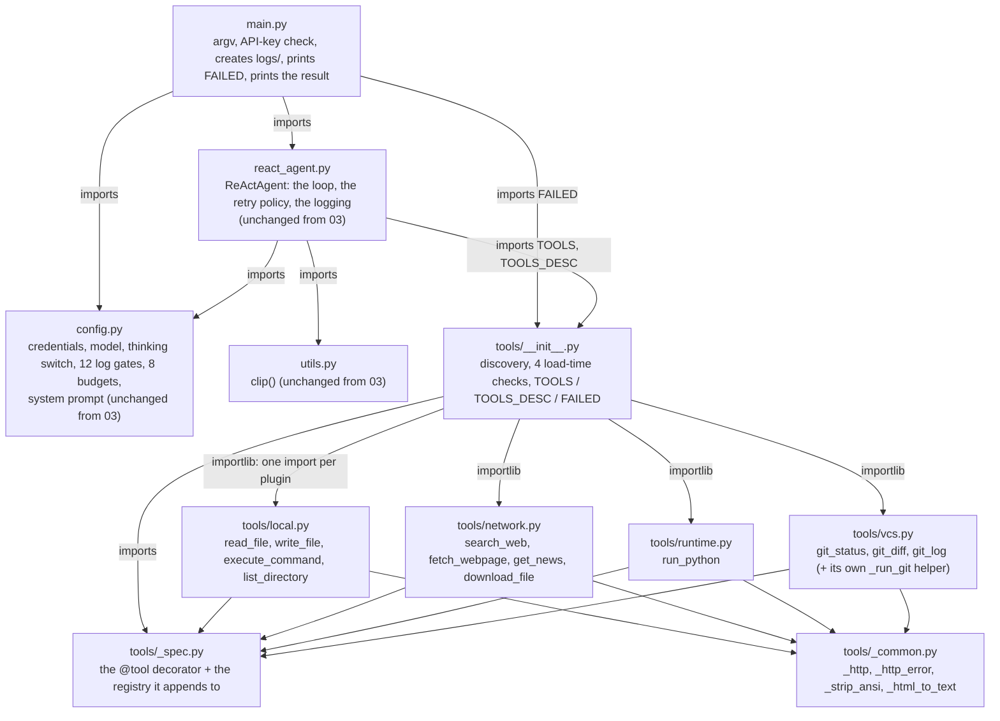
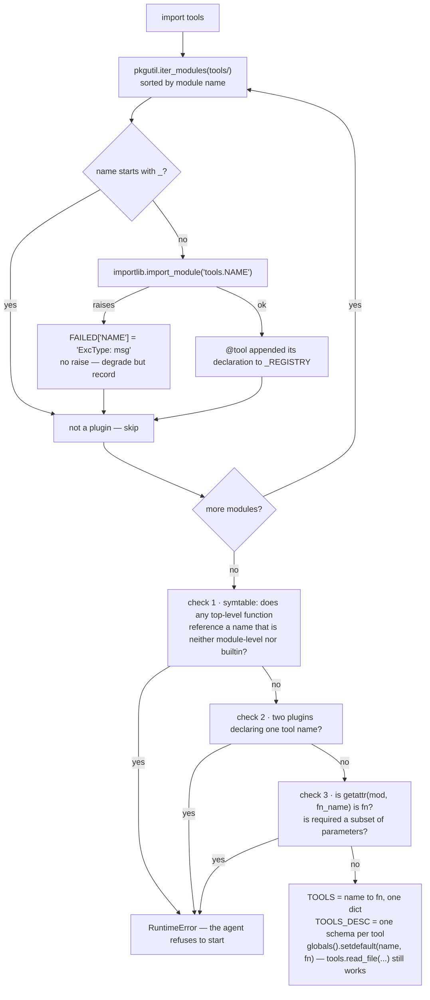

# More-Tools ReAct Agent

The fourth entry in the `mini-agent-system/` series: the same agent as
[`../03-react-agent-with-error-handling/`](../03-react-agent-with-error-handling/), with the same
loop, the same retry policy, the same thinking channel and the same budgets — and a tools layer
that grew from three functions in one file to twelve functions in a package, without
`react_agent.py` noticing.

That is the whole lesson, and it is why `react_agent.py`, `config.py` and `utils.py` here are
**byte-for-byte identical to 03's**. Read 04 as a diff against 03: the only files that changed are
`main.py` (six lines) and the tools layer, which went from a module to a directory. Read
[Differences from 03](#differences-from-03-react-agent-with-error-handling) for what actually
changed and why.

03 spent its budget on what happens when a tool fails *at runtime*. 04 spends its on what happens
*before the agent starts* — because a toolkit that grows by copy-paste develops a second class of
failure that never appears in a log:

| Problem | Examples | Who can fix it | What happens |
| --- | --- | --- | --- |
| **Author error** | a plugin function missing an import; two plugins claiming one tool name; a `@tool` that forgot `return fn`; a `required` entry that is not in `parameters` | you, by editing the file | `RuntimeError` at import — the agent refuses to start |
| **Environment problem** | a plugin that will not import (missing dependency, and — see Limitations — a syntax error) | the environment, or you later | recorded in `FAILED`, those tools simply do not exist, the agent runs |
| **Runtime failure** | everything 03 already classified | 03's rule, unchanged | transient → retried in code; deterministic → back to the model |

The first row is the new idea. In 03 the argument was "a `FileNotFoundError` is deterministic, so
retrying it only delays the feedback the model needs". In 04 the same argument is applied one level
up: a plugin whose function body references a name that does not exist is deterministic too, and the
only reason it does not fail at import is that Python does not execute function bodies at import. A
loader can check it anyway, which turns "the agent runs fine until the model calls this one tool" into
"the agent does not start".

## Structure

Four modules plus a package, where 03 had five modules and no package. `main.py` is still the only
entry point and `react_agent.py` is still the only module that talks to the model:



Two properties of that graph are the design:

- **`tools/__init__.py` is the only file that knows every tool exists.** Each plugin knows only
  `_spec` and `_common`; `react_agent.py` knows only `TOOLS` and `TOOLS_DESC`. Adding a tool means
  adding a decorated function to any non-underscore `tools/*.py` — no other file in the repository
  changes, which is the property 03 did not have.
- **`tools.py` is gone.** 01, 02 and 03 all still have one, and they are still byte-for-byte
  identical to each other; 04 is where the series stops having a `tools.py` at all.

`_spec.py` and `_common.py` are shared code, not plugins, and the leading underscore is what says so
— see ② below. `_common.py` holds only what *several* plugin groups use; a helper only one group
needs stays with that group (`vcs.py`'s `_run_git` is the example).

### What one load does

`import tools` runs once, before `main.py` can check anything. The loader discovers plugins, then
validates what they declared:



Three properties of that picture are easy to break when editing:

- **Discovery order is module-name order, and it is the schema order the model sees.** `sorted(...,
  key=lambda m: m.name)` (`tools/__init__.py:77`) is load-bearing twice: a deterministic
  `TOOLS_DESC` makes runs reproducible and diffs readable. The order shipped here is `local`,
  `network`, `runtime`, `vcs`; renaming a plugin file reorders the schemas.
- **A plugin that fails to import is a degraded agent, not a broken one — and the degradation is
  asymmetric.** The human sees the `FAILED` line `main.py` prints; the model does not. It is handed
  a twelve-tool schema with holes in it and no way to know they are holes.
- **`TOOLS` and `TOOLS_DESC` cannot drift, because neither is written by hand.** Both are projections
  of the single list `_REGISTRY` filled in by the decorator (`tools/__init__.py:85`, `:137`, `:144`).
  In 03 they were two hand-written structures that had to be edited together; here the question
  "did you update both?" cannot be asked.

## Requirements

- Python 3.x — developed on 3.14.7 (miniconda base)
- `openai` installed (`pip install openai`) — currently 3.17.0, installed globally rather than
  pinned, so version drift is possible. Everything 03 says about `DEFAULT_MAX_RETRIES = 2` and the
  retry decision table in `_base_client.py` applies unchanged here.
- An API key for a DeepSeek-compatible endpoint, with a model that supports the thinking channel
  described in 03's README.
- Four more libraries, all of them **optional at startup** and imported lazily inside the tool
  function that needs them:

  | Library | Used by | Installed here |
  | --- | --- | --- |
  | `requests` | every network tool, via `_common._http` | 2.34.2 |
  | `bs4` (+ `lxml`) | `fetch_webpage`, via `_common._html_to_text` | 4.15.0 (+ 6.1.3) |
  | `ddgs` | `search_web` | 9.16.0 |
  | `feedparser` | `get_news` | 6.0.14 |

  Because the imports are inside the functions, a missing one does **not** stop the agent: it
  surfaces later as an ordinary `Error: ...` observation when the model calls that tool. `lxml` is
  optional twice over — `_html_to_text` falls back to the stdlib `html.parser` — but a missing `bs4`
  is not caught anywhere and simply fails that one call.

There is still no dependency manifest and no build step.

## Setup

Credentials come from the environment; every variable has a fallback, but the default key is a
placeholder. `config.py` is byte-for-byte identical to 03's, so this table is 03's table:

| Variable | Default |
| --- | --- |
| `DEEPSEEK_API_KEY` | `sk-your-key-here` |
| `DEEPSEEK_BASE_URL` | `https://api.deepseek.com` |
| `DEEPSEEK_MODEL_NAME` | `deepseek-flash` |
| `DEEPSEEK_THINKING` | `enabled` — `"enabled"` or `"disabled"` |

```bash
export DEEPSEEK_API_KEY=sk-...
```

The program exits immediately if the key is still the placeholder.

## Running

```bash
cd 04-react-agent-with-more-tools
python3 main.py 'search the web for the DeepSeek API docs and summarize them'
```

The prompt is a single command-line argument, so quote it. Run from this directory: `logs/` is
created by `main.py` and `run_python` writes its scratch files to `tmp/`, both relative to the
working directory.

stdout narrates the loop exactly as 03 does — `--- Round N ---`, `💭 Reasoning`, `🤔 Thought`,
`🔧 Action`, `👁 Observation` (truncated to 200 chars), `[Final]` / `[Done]` — and ends with a
`Result:` block. One line is new, and it prints before the loop starts:

```
⚠ These tool plugins failed to load; their tools are unavailable: {'network': "ModuleNotFoundError: No module named 'requests'"}
```

If you see that line, the run is not wrong — it is running with a smaller toolkit than the README
describes, and the model was never told.

## How it works

### ① One decorator is the whole registration

03 registered each tool twice: a `TOOLS` dict for dispatch and a `TOOLS_DESC` list for the model.
Two structures, one meaning, kept in sync by hand — omit the first and the model gets a spurious
tool error, omit the second and the tool is invisible.

04 carries the schema next to the function instead (`tools/_spec.py:6`):

```python
@tool(
    description="Read a UTF-8 text file and return its contents.",
    parameters={"path": {"type": "string", "description": "Path to the file to read"}},
    required=["path"],
)
def read_file(path: str) -> str:
    ...
```

`name` defaults to `fn.__name__`, so the name used for dispatch and the name sent to the model
*cannot* disagree — the decorator appends one dict to `_REGISTRY` and both projections are built
from it. Four consequences:

- **Adding a tool means adding a decorated function.** Nothing else in the repository changes. The
  loader picks the file up by name; the schema order changes only if the file name does.
- **Only top-level decorated functions register.** A private helper (`vcs._run_git`) is a plain
  function, and it is not a tool. Helpers shared by two plugins belong in `_common.py`.
- **Per-argument defaults live in the Python signature**, not in the schema, so an all-default tool
  declares `required=[]` and the model may call it with no arguments (`get_news`, `git_status`,
  `git_diff`, `git_log`, `list_directory` all do).
- **`required` must be a subset of `parameters`** — enforced at load time, see ③.

### ② The loader: discovery is a file-name convention

`tools/__init__.py:77` walks the package with `pkgutil.iter_modules`, skips anything whose name
starts with `_`, and imports the rest with `importlib`:

```python
for _m in sorted(pkgutil.iter_modules(__path__), key=lambda m: m.name):
    if _m.name.startswith("_"):        # _spec / _common are shared code, not plugins
        continue
    try:
        importlib.import_module(f"{__name__}.{_m.name}")
    except Exception as e:
        FAILED[_m.name] = f"{type(e).__name__}: {e}"
```

The underscore convention is what keeps `_spec` and `_common` out of the registry without a
manifest, a decorator or a config list. It also means a file called `_scratch.py` dropped into
`tools/` is inert, which is a convenient way to park code you are not ready to register.

Importing a module is what runs its decorators, so `_tools = registry()` on the next line is the
complete set of declarations. The functions are then hung on the package namespace with
`globals().setdefault(...)`, so `tools.read_file(...)` still works the way `tools.py`'s functions
did — `setdefault` rather than assignment, so a tool can never shadow `TOOLS`, `TOOLS_DESC` or
`FAILED`.

### ③ Load-time validation: author errors fail at import

Everything below raises, which means the agent refuses to start. All four are deterministic
mistakes that would otherwise surface only at runtime, as "this tool is a bit flaky":

**1 · A name that does not exist** (`tools/__init__.py:97-105`). Splitting one file into six means
every file carries its own imports, and **a missing import does not raise at import time** — a
function body only runs when it is called. Without this check the agent starts normally and blows up
with a `NameError` the first time the model calls that tool. The check parses the plugin with `ast`,
extracts each top-level function's source, and walks a `symtable` of it looking for names that are
global, never assigned, not module-level and not builtin:

```python
def walk(table):
    for sym in table.get_symbols():
        n = sym.get_name()
        if (sym.is_global() and not sym.is_assigned()
                and n not in names and not hasattr(_builtins, n)):
            bad.add(n)
    for child in table.get_children():
        walk(child)
```

`symtable` rather than a regex because it answers exactly the question that matters — *is this name
looked up as a global?* — and it descends into nested functions and lambdas. It scans **all**
top-level functions in the module, not just the tools: `_run_git` missing an import breaks three
tools when called, and `_run_git` is not itself a tool. Modules that contributed no tool at all are
not scanned.

**2 · Two plugins declaring one tool name** (`:107-113`). `TOOLS` is a dict, so the later one
silently wins; the check counts names and raises instead.

**3 · A `@tool` that forgot `return fn`** (`:120-128`). The registry still holds the real function,
so the tool works — but the plugin's *module attribute* was overwritten by the decorator's return
value, and `tools.xxx` becomes `None`. It is caught by comparing identity:

```python
_attr = getattr(_mod, _fn_name, None)
if _attr is not _t["fn"]:
    raise RuntimeError(...)
```

Note what this is not: `callable(_t["fn"])` would be always `True` — a line of dead code that reads
like a check.

**4 · `required` naming a parameter that does not exist** (`:130-134`). The model cannot supply an
argument that is not in `properties`, so the schema would be unsatisfiable.

The other failure mode is deliberate and opposite: **a plugin that cannot be imported does not
raise.** It lands in `FAILED` and its tools do not exist. The line between the two is *not* "author
versus environment" — it is **"raises during validation" versus "fails to import"**, and the
difference is visible: a plugin with a syntax error is an author error, and it degrades (see
Limitations). `main.py:26-27` exists to make that degradation non-silent:

```python
if FAILED:
    print(f"⚠ These tool plugins failed to load; their tools are unavailable: {FAILED}")
```

Delete those lines and the whole "degrade but record" design becomes "degrade silently", which is
strictly worse than failing to start.

### ④ The tool boundary: problems that only exist once you have network tools

03's three tools were local and well-behaved: a file read either worked or raised something
Python already classifies correctly. Nine new tools brought four problems that needed a shared
answer, and `_common.py` is where they live.

**`_http` exists for one reason.** 03's retry policy recognises only the builtin `ConnectionError`,
`TimeoutError` and `subprocess.TimeoutExpired`:

```python
RETRIABLE_ERRORS = (subprocess.TimeoutExpired, ConnectionError, TimeoutError)
```

`requests`' exceptions do not inherit from those — they inherit from `OSError`
(`issubclass(requests.exceptions.ConnectionError, ConnectionError)` is `False`, measured). So a
network blip would fall into `_call_tool`'s generic `except Exception`, come back to the model as an
ordinary `Error: ...`, look perfectly normal, and **never be retried**. `_common._http`
(`tools/_common.py:28`) is the single translation point:

```python
_NETWORK_ERRORS = (requests.exceptions.ConnectionError,
                   requests.exceptions.Timeout,
                   requests.exceptions.ChunkedEncodingError)
try:
    return requests.request(method, url, timeout=(5, timeout), headers=_HEADERS, **kw)
except _NETWORK_ERRORS as e:
    raise ConnectionError(f"Network error occurred: {e}")
```

The rule that follows: **every request goes through `_http`.** A new network tool that calls
`requests` directly still appears to work — its failures just never retry. The timeout is a pair:
connect is pinned at 5 s, the read timeout is the caller's (20 s for `fetch_webpage` and `get_news`,
60 s for `download_file`). Failing to connect and responding slowly are different things; an
unreachable host gives the same verdict at 5 s as at 20 s, and with up to 14 attempts across the
retry budget that difference is about 3.5 minutes of pure waiting.

**`_http_error` splits the status code the same way 03 splits exceptions** (`tools/_common.py:142`).
5xx raises `ConnectionError` — transient, so it retries. 4xx returns a string — deterministic
(wrong URL, deleted, no permission), so it goes back to the model, which can actually fix a URL.
Collapsing both into "request failed" is the easy version and the expensive one: it either waits out
retries for nothing or robs the model of the chance to correct itself. Note the ordering rule this
creates — `_http` deliberately does not raise on a non-2xx response, so *every* caller must ask
`_http_error` before touching the body.

**`_strip_ansi` because colour cannot be turned off reliably from the outside** (`:87`). Two
measured attempts: Python 3.13+ honours `FORCE_COLOR` even when stdout is a pipe, and
`git -c color.ui=false` loses to a more specific `color.status=always` in the user's gitconfig.
Escape bytes reaching an observation are counted as body text by `clip()` and eat the model's
context budget as mojibake.

**`_html_to_text` because a webpage is not text** (`:110`). `bs4` + `lxml` build a real tree, so
unclosed `<p>` tags and tables missing `</td>` recover; `decompose()` removes whole subtrees, which
an unpaired `<script>` cannot wedge. `_SKIP_TAGS` drops `script/style/noscript/head/svg/template`
plus `nav/header/footer/aside` — the last four were added after a measurement, on one content page,
of 98% less body noise. The fallback to `html.parser` must never be written as `except: return ""`:
every page would look empty and the model would conclude the page has no content.

## Thinking mode

Unchanged from 03, and still the default path (`DEEPSEEK_THINKING=enabled`; `deepseek-flash` is a
thinking model). Nothing in this lesson touches it. The short version, for a reader who arrived here
first:

- **The response carries `reasoning_content`, and history must echo it back.** Because every request
  sends `tools`, the next request is rejected with
  `400 ... The reasoning_content in the thinking mode must be passed back to the API` unless every
  historical assistant message still carries it — including the empty string, which is why the check
  is `is not None` (`react_agent.py:282`) and not a truthiness test. The rule is keyed on the request
  carrying `tools`, not on that turn having called one, so violations show up as intermittent `400`s.
- **The chain of thought goes into `reasoning_content`, leaving `content` empty** or a one-line
  lead-in — that is what the `💭 Reasoning:` / `💭 Lead-in:` lines parse.
- **Turning thinking off does not restore ReAct format compliance.** The prompt is the only thing
  asking for `Thought:`, so `🤔 Thought:` prints sporadically at best either way.

The tools-layer consequence, which is why it is worth restating here: a retry wrapper for tool
failures that swallowed `400`s would turn a broken `reasoning_content` echo into an invisible
correctness bug. That is why `BadRequestError` is handled in the API layer, outside `_call_tool`, and
returns rather than retries. 04 inherits that arrangement untouched.

## Tools

Twelve tools, four plugins. `TOOLS_DESC` order — the order the model sees — is module-name order,
then source order within a module:

| Tool | File | What it does |
| --- | --- | --- |
| `read_file(path)` | `local.py` | Return a UTF-8 text file's contents. Binary raises `UnicodeDecodeError`, which 03's policy hands straight back to the model |
| `write_file(path, content)` | `local.py` | Write text, creating parent directories. Overwrites; not append |
| `execute_command(command)` | `local.py` | Shell command, merged stdout+stderr, ANSI stripped, exit code appended (30 s timeout) |
| `list_directory(path='.')` | `local.py` | One entry per line, tagged `[DIR]` / `[FILE]`, not recursive, unsorted |
| `search_web(query, limit=5)` | `network.py` | Title / URL / snippet per result, via `ddgs` |
| `fetch_webpage(url, max_chars=6000)` | `network.py` | Fetch a URL and return readable text, tags stripped |
| `get_news(keyword='', limit=10, lang='zh')` | `network.py` | Google News headlines; prints the publisher's domain, not Google's redirect shell |
| `download_file(url, path, max_bytes=10_000_000)` | `network.py` | Fetch a URL to a local file byte for byte; returns a summary, never the content |
| `run_python(code, timeout=30)` | `runtime.py` | Run a snippet in a fresh subprocess with `sys.executable` |
| `git_status(path='.')` | `vcs.py` | `git status --short --branch` |
| `git_diff(path='.', staged=False, target='')` | `vcs.py` | Working tree or index diff; `target="--stat"` works because git treats it as an option |
| `git_log(path='.', limit=20)` | `vcs.py` | One compact line per commit |

Five things about them are worth knowing before you edit one:

- **`fetch_webpage` truncates head-only, on purpose, and does not use `clip()`.** `clip()` keeps
  6000 head + 1500 tail; for a page that would splice the footer onto the end of the article. So the
  page text is cut to `max_chars` here and marked `...[N more characters not shown]`. The default
  6000 plus the header stays under `MAX_OBS_CHARS` (8000), so in practice the model sees exactly
  what this tool chose to give it — the safety net is for the other eleven.
- **`get_news` deliberately does not print `entry["link"]`.** It is a
  `news.google.com/rss/articles/<id>` JS redirect shell; measured, that 593 KB page contains no real
  news links. The publisher's domain is printed instead, because `fetch_webpage` can actually fetch
  that. The other trap there: `feedparser` never raises — on failure it returns zero entries and
  `bozo` is not necessarily `True` (measured: an HTML error page gave `entries=0, bozo=False`), so
  the only usable signal is `entries`, and an empty feed is raised as a transient failure rather than
  returned as "there is no news".
- **`download_file` is the only binary path.** `write_file` is text mode with
  `encoding='utf-8'` and would corrupt an image or a zip. It creates parent directories, checks
  `Content-Length` *and* the streamed byte count against `max_bytes`, and deletes the partial file
  when the streamed check trips.
- **`run_python` and `vcs._run_git` catch `TimeoutExpired` and return a string; `execute_command`
  does not — and that inconsistency is deliberate and unresolved.** `TimeoutExpired` is in
  `RETRIABLE_ERRORS`, so copying 03's convention would auto-rerun a timed-out snippet up to three
  times, i.e. replay its side effects. The two new tools opt out; the old one still does not, so a
  genuinely stuck command costs up to `1 + MAX_TOOL_RETRIES` × 30 s. Both behaviours are commented in
  place. Don't quietly "fix" it in either direction — it is a decision, not an oversight.
- **`run_python` leaves `tmp/agent_py_<millis>.py` behind on every call** and never cleans up, and
  `vcs._run_git` passes `-c core.quotepath=false` so non-ASCII filenames do not come back as
  `\346\226\207`, plus `GIT_PAGER=cat`/`GIT_TERMINAL_PROMPT=0` so git can never block on a TTY or a
  credential prompt. The git tools are a read-only whitelist: `status`, `diff`, `log`, nothing that
  writes to a repository.

## Logging

Unchanged from 03, because `config.py` is unchanged: `logs/deepseek_log_<YYYYmmdd_HHMMSS>.log`, one
file per process, never truncated, `EXPORT_LOG` and `EXPORT_LOG_CHOICES` (`config.py:17`) both
gating. The same 12 gates, the same section re-dumps of the whole history — see 03's README for what
each line means.

The tools layer adds **no gates at all**, and that is a gap worth naming: `_common.py` and the four
plugins contain no logging. The one new signal 04 introduces — a plugin failing to load — goes to
**stdout only**. A run started with a broken plugin produces a completely normal-looking log; the
only record that the toolkit shrank is the `⚠` line in the terminal, which is gone the moment you
scroll.

## Differences from 03-react-agent-with-error-handling

This directory started as a copy of 03. Three files were not touched at all, and everything else is
the tools layer plus six lines of `main.py`.

### Registration and loading

| | 03 | 04 |
| --- | --- | --- |
| Tools | 3, all in `tools.py` | 12, in 4 plugins + 2 shared modules |
| Registration | `TOOLS` and `TOOLS_DESC` written by hand, kept in sync by discipline | one `@tool` declaration; both are projections of `_REGISTRY` |
| Discovery | none — one module, imported directly | `pkgutil.iter_modules`, sorted by name, `_`-prefixed files skipped |
| Schema order | source order in `tools.py` | module-name order, then source order |
| Missing import inside a tool body | `NameError` at call time | `RuntimeError` at import — the agent refuses to start |
| Duplicate tool name | collapses silently in the `TOOLS` literal | detected at import |
| `@tool` deco forgetting `return fn` | n/a | detected at import |
| `required` ⊄ `parameters` | n/a | detected at import |
| Plugin that will not import | n/a | `FAILED`, printed by `main.py`, agent runs without those tools |
| Shared tool helpers | none — each function stood alone | `tools/_common.py` |

### The tools themselves

| Tool | 03 | 04 |
| --- | --- | --- |
| `read_file` | `open(path)` | `+ os.path.expanduser(path)`; docstring points at `download_file` for binary |
| `write_file` | `open(path, 'w')` | `+ os.path.expanduser(path)`; otherwise identical, one-liner `makedirs` quirk included |
| `execute_command` | `return stdout + stderr` | + `encoding='utf-8', errors='replace'`, ANSI stripped, `(exit code N)` appended |
| `list_directory`, `search_web`, `fetch_webpage`, `get_news`, `download_file`, `run_python`, `git_status`, `git_diff`, `git_log` | — | new |
| Network failures | n/a | translated to builtin `ConnectionError` at `_http`, so 03's retry policy actually engages |
| HTTP status | n/a | 5xx raises (retry), 4xx returns a string (the model fixes the URL) |
| Timeout handling | one rule | `run_python` and `_run_git` deviate on purpose; `execute_command` was not aligned — see Tools |

### Everything else

| | 03 | 04 |
| --- | --- | --- |
| `react_agent.py` | — | byte-for-byte identical |
| `config.py` | — | byte-for-byte identical (same 12 gates, same 8 budgets) |
| `utils.py` | — | byte-for-byte identical |
| `tools.py` | exists | replaced by the `tools/` package |
| `main.py` | creates `logs/` | +6 lines: `from tools import FAILED` and the warning |
| Log gates | 12 | 12 — the tools layer contributes none |
| stdout | loop narration + `Result:` block | same, plus the one `⚠` line |

Four of those are substantive:

**The registration problem was solved structurally rather than by discipline.** 03's README says of
its two structures that "both must be updated together" — a rule a human has to remember. In 04
there is one declaration and no second place to forget. This is the same move 03 made when it
replaced an inline `json.loads` with `_parse_args`: the fix is not "be careful", it is "make the
mistake unrepresentable".

**03's "who can fix it" line was redrawn one level up, and the same argument decided it.** A plugin
whose function body names something that does not exist is deterministic and fixable by you, so it
fails at startup. A plugin that will not import is an environment problem, so it degrades and is
recorded. That is exactly 03's split — deterministic → immediate, honest feedback; transient →
absorbed in code — applied to load time instead of call time.

**Nine new tools created a boundary layer that did not exist, and it exists for one specific
reason.** `_http` is not "a helper for making requests"; it is the only place `requests`' exception
hierarchy is translated into the builtin one that `RETRIABLE_ERRORS` recognises. Without it, 03's
retry policy — the previous lesson's entire subject — is silently inert for every network tool.

**Growing the toolkit 4× moves the pressure from the loop to the schema.** All twelve schemas ride
on every request, in every round, forever. The tools layer is no longer free: tool descriptions are
prompt tokens and tool selection is a harder problem for the model with twelve options than with
three. 04 does not measure this; 03's Limitations section on uncapped history growth is where that
thread continues.

Two things got worse:

- **A degraded toolkit is invisible to the model.** `main.py` prints `FAILED` for the human, but the
  model receives a schema with a hole in it and no indication that anything is missing — it will
  plan around tools it cannot see.
- **The loader's line is drawn at "validation" versus "import", not at "author" versus
  "environment".** A plugin with a *syntax error* is an author error, and it degrades into `FAILED`
  exactly like a missing dependency (verified). So the check that catches a missing import in a
  function body does not catch a file that does not parse.

Everything else is unchanged, byte for byte: the loop, `_parse_args`, `_call_tool`,
`RETRIABLE_ERRORS` and its four rules, the `str()` → `raw_len` → `clip()` ordering, the three
budgets, `reasoning_content` echoing, the `Final Answer:` check, the one-assistant-plus-N-tool-results
message shape, `self.plan` as an unused placeholder, and the whole logging section.

## Limitations

This is a teaching example, not a safe or complete agent. Everything in 03's Limitations still
holds — three uncapped history-growth axes, failures that are indistinguishable from answers,
retries that ignore idempotency, an unbounded `logs/`, no sandbox, no memory, no tests — and 04
widens the surface considerably:

- **The attack surface grew with the toolkit.** `download_file` writes arbitrary URLs to arbitrary
  paths, byte for byte, with no extension or content-type check; `fetch_webpage`, `search_web` and
  `get_news` reach the open internet; `run_python` executes code **the model wrote** with
  `sys.executable` — the agent's own interpreter, environment and permissions. The environment it
  passes (`NO_COLOR`, `PYTHON_COLORS=0`, `TERM=dumb`) only turns colours off; it restricts nothing.
  `execute_command` will happily run `rm -rf`. Run all of this in a scratch directory.
- **`tmp/` accumulates.** Every `run_python` call leaves a `tmp/agent_py_*.py` behind, by design and
  without cleanup.
- **Failure to load is silent to the model, loud only to the human.** See above. A long agent run in
  a terminal you scrolled past may have had nine tools, not twelve.
- **The load-time checks are a floor, not a proof.** They catch four specific mistakes. They cannot
  catch a `description` that lies about what a tool does, a `parameters` schema that does not match
  the Python signature, or a tool that is simply wrong. Nothing here is type-checked or tested.
- **`tools/__init__.py`'s docstring refers to a `_test.py` that does not exist.** There is no test
  suite in this directory, and there never was.
- **A tool named `TOOLS`, `TOOLS_DESC` or `FAILED` would be registered in `TOOLS` but would not get
  a package-namespace alias** — `globals().setdefault(...)` protects the loader's own names. Nothing
  checks for this.
- **`_undefined_globals` gives up when it cannot read a module's source** (frozen or `exec`-created
  modules return `{}`), preferring a missed bug to a false alarm.
- **The retry/idempotency hole from 03 got bigger, not smaller.** Two new tools opt out of the
  retry-on-timeout rule by hand; the rule itself is still exception-type-only, so `execute_command`
  keeps the problem 03 documented.
- **`git_diff` can lie by clipping.** A large diff exceeds `MAX_OBS_CHARS`, `clip()` removes the
  middle, and the model sees a "complete diff" that is not complete. The docstring tells the model to
  check `git_status` first or use `target="--stat"`; nothing enforces it.
- **No git.** A bad edit here cannot be rolled back.

## Layout

```
main.py            entry point: argv, key check, creates logs/, prints FAILED, calls ReActAgent().run()
react_agent.py     the ReActAgent class (byte-identical to 03)
utils.py           clip() (byte-identical to 03)
config.py          credentials, model, thinking switch, 12 log gates, 8 budgets, system prompt (byte-identical to 03)
tools/
  __init__.py      the loader: discovery, 4 load-time checks, TOOLS / TOOLS_DESC / FAILED
  _spec.py         the @tool decorator and the registry it appends to
  _common.py       helpers shared by several plugins: _http, _http_error, _strip_ansi, _html_to_text
  local.py         read_file, write_file, execute_command, list_directory
  network.py       search_web, fetch_webpage, get_news, download_file
  runtime.py       run_python
  vcs.py           git_status, git_diff, git_log (+ the private _run_git helper)
```

Indentation is tabs in `react_agent.py`, `config.py`, `main.py` and `utils.py` — inherited from 03 —
and 4 spaces in every file under `tools/`, matching `tools.py` in 01–03. The split is consistent:
agent-side files are tab-indented, tool-side files are not, so `tools/__init__.py` (spaces) is loaded
by the tab-indented `main.py` that imports it.
