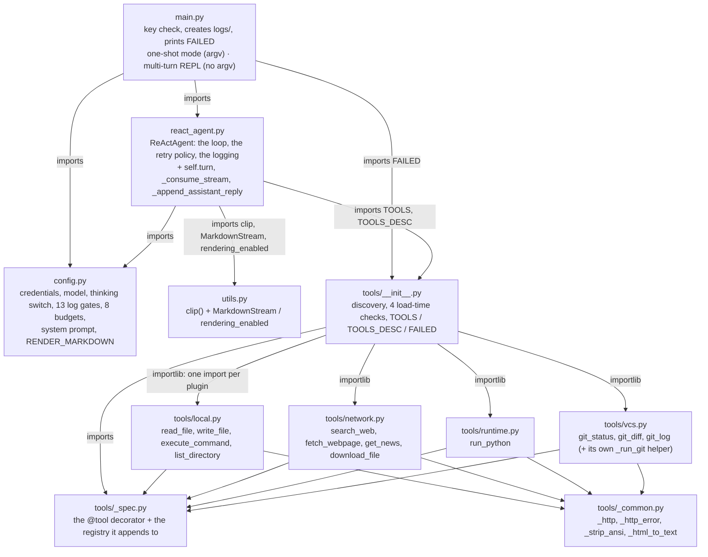
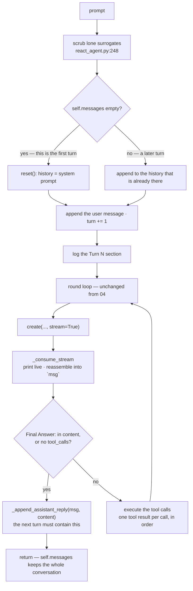

# Multi-Round ReAct Agent

The fifth entry in the `mini-agent-system/` series: the same loop, the same retry policy, the same
thinking channel, the same budgets and the same twelve tools as
[`../04-react-agent-with-more-tools/`](../04-react-agent-with-more-tools/) — and a conversation that
survives from one turn to the next.

That is the whole lesson, and it is why every file under `tools/` here is **byte-for-byte identical
to 04's** — all seven of them, verified by hash: the same twelve tools, the same schemas, the same
loader with its four load-time checks, the same comments. A conversation needed nothing from the
tools layer. Read 05 as a diff against 04.

04's agent did one thing and exited. `run(prompt)` called `reset(prompt)`, which rebuilt the history
from scratch, and the process ended when the answer came back. A conversation needs the opposite: the
history has to survive, and the model's own closing reply has to be part of it. Everything in this
lesson follows from turning that one line of state into something that outlives a call:

| Requirement | What it costs when the agent runs once | What 05 does |
| --- | --- | --- |
| **The next turn must see this one** | `reset(prompt)` rebuilds the history on every `run()` — free, because there is no next turn | `run()` appends; `reset()` runs only on the first turn |
| **The model's own answer is context** | the returned string is printed and dropped | `_append_assistant_reply()` writes it back into `self.messages` |
| **A turn interrupted half-written poisons the *next* request** | impossible — the process is gone | `main.py` snapshots the history and rolls the turn back on Ctrl-C |
| **Text should appear as it is generated** | prints happen after the round completes | `create(stream=True)`, then re-assembled into the exact shape the rest of the code already expected |
| **Terminal input is not always valid text** | a one-shot prompt comes from argv | `import readline`, plus a surrogate scrub at the head of `run()` |

The first two rows are the subject. The last three are what the subject dragged in: streaming is what
forced a re-think of what a "message" is now that there is no SDK response object, markdown rendering
is what happens when a human reads a conversation instead of a log, and the surrogate scrub exists
because two real crashes on 2026-10-06 traced back to backspacing over a Chinese character in WSL.

## Structure

Four modules plus a package, exactly as 04 — and `main.py` now has two modes instead of one:



Two things about that picture are worth stating, because both are easy to get wrong when editing:

- **`tools/` did not move at all.** Byte-for-byte 04's. A conversation needed nothing from the tools
  layer, which is the payoff of 04's design: the toolkit grew from three tools to twelve without
  `react_agent.py` noticing, and now the agent grew a second mode without the toolkit noticing.
- **`utils.py` is no longer a one-function leaf.** It went from 17 lines to 130, and `react_agent.py`
  now imports three names from it instead of one. It is still a leaf — it imports only `config` — but
  it is now the second-largest file in the directory.

### What one turn does

`run()` is still the whole agent, and the round loop inside it is 04's verbatim. What changed is its
head, its tail, and the way each round gets its answer:



The loop above the dotted line is 04's, and the shape rule that governs it is still enforced by the
API: one assistant message per round carrying all of that round's `tool_calls`, then exactly one
`role: "tool"` reply per call, in order, carrying the matching `tool_call_id`. What is new is that
this shape now has to hold **across turns as well as within one** — and that is where the Ctrl-C
rollback below comes from.

## Requirements

- Python 3.x — developed on 3.14.7 (miniconda base)
- `openai` installed (`pip install openai`) — currently 3.17.0, installed globally rather than
  pinned, so version drift is possible. 04's notes on `DEFAULT_MAX_RETRIES = 2` apply unchanged.
- An API key for a DeepSeek-compatible endpoint, with a model that supports the thinking channel.
  Streaming is an extra requirement of the endpoint, not of the SDK — anything OpenAI-compatible
  serves `stream=True`.
- The same four optional libraries as 04, imported lazily inside the tool functions that need them:
  `requests` (2.34.2), `bs4` + `lxml` (4.15.0 / 6.1.3), `ddgs` (9.16.0), `feedparser` (6.0.14). A
  missing one still does not stop the agent; it surfaces as an `Error: ...` observation the first
  time the model calls that tool.
- `readline`, for the interactive mode. It is in the stdlib on Linux and macOS; the import is
  wrapped in `try/except ImportError` (`main.py:19-22`), so a platform without it falls back to
  plain `input()` — which is exactly the behaviour that caused the crash described in ⑤.

There is still no dependency manifest, no build step and no test suite.

## Setup

`config.py` is 04's with two additions, so this table is 04's table:

| Variable | Default |
| --- | --- |
| `DEEPSEEK_API_KEY` | `sk-your-key-here` |
| `DEEPSEEK_BASE_URL` | `https://api.deepseek.com` |
| `DEEPSEEK_MODEL_NAME` | `deepseek-flash` |
| `DEEPSEEK_THINKING` | `enabled` — `"enabled"` or `"disabled"` |

```bash
export DEEPSEEK_API_KEY=sk-...
```

The program exits immediately if the key is still the placeholder.

## Running

Two modes, decided by whether there is an argument:

```bash
cd 05-multi-round-agent

python3 main.py                                  # multi-turn: type, get an answer, type again
python3 main.py 'summarize the files in tmp/'    # one-shot: run once and exit, as in 04
```

The multi-turn mode is a loop, not a CLI framework:

```
Multi-turn mode: type your prompt, or exit / quit / Ctrl-D to leave.

[1] you > what is in this directory?
--- Round 1 ---
🔧 Action: list_directory({'path': '.'})
👁 Observation: [FILE] main.py
...
[2] you > and what does the first file do?
```

- The prompt shows `[N] you > `, where `N` is `agent.turn + 1` — the turn about to start.
- `exit`, `quit` and `/exit` leave. So does Ctrl-D (`EOFError`). An empty or whitespace-only line is
  ignored.
- **The conversation lives in `agent.messages` and nowhere else.** Nothing is persisted to disk,
  nothing is shared between processes, and there is no way to resume a session. `logs/` is a debug
  record, not memory — see Logging.
- One-shot mode prints `Task:` and a rule, calls `run(prompt)`, and exits. There is no `Result:`
  block any more, because the answer has already been printed as it streamed.

Run from this directory: `logs/` and `tmp/` are created relative to the working directory. stdout
now depends on where it is going — on a terminal you get live, markdown-rendered output; piped or
redirected you get the raw deltas as they arrive (see ⑥). The narration is otherwise 04's:
`--- Round N ---`, `🔧 Action`, `👁 Observation` (truncated to 200 chars), `[Final]` / `[Done]`.

## How it works

### ① One flag decides whether this is a conversation

This is the entire multi-turn change, and it is three lines (`react_agent.py:253-257`):

```python
first_turn = not self.messages
if first_turn:
    self.reset()
self.messages.append({"role": "user", "content": prompt})
self.turn += 1
```

04's `run()` began with `self.reset(prompt)`, and `reset` took the prompt because it built the whole
history itself:

```python
def reset(self, prompt):                       # 04
    self.messages = [
        {"role": "system", "content": self.system_prompt},
        {"role": "user", "content": prompt}
    ]
```

In 05 `reset()` takes nothing and seeds only the system prompt — and it is called **only when the
history is empty**. The prompt moves out of `reset` into `run`, where it is appended rather than
assumed to be the second message. Every later turn falls through to the same `append`.

The docstring says the quiet part out loud, because this is the mistake the file is designed around:

```
Do NOT call this between turns of a multi-round session — that is exactly
what throws the conversation away.
```

There is no second place where history can be lost, because nothing else constructs `self.messages`.

**The consequence that is easy to miss: the model's own reply is now context.** In 04, `run()` returned
the final content and that was the end of it. In 05 the reply has to go back into the history, or the
next turn's request contains a conversation in which the model answered and then the user spoke again
with no record of the answer. `_append_assistant_reply` (`react_agent.py:132`) is that write-back:

```python
reply = {"role": "assistant", "content": content}
reasoning = getattr(msg, "reasoning_content", None)
if reasoning is not None:
    reply["reasoning_content"] = reasoning      # is not None — not truthiness
self.messages.append(reply)
```

It is called on both exits — the `Final Answer:` path (`:386`) and the no-tool-call path (`:392`) —
and it repeats the reasoning echo rule from the tool-call branch, including the part that looks like
a bug until you have been bitten by it: with thinking on, an **empty string** must still be passed
back, which is why the test is `is not None`. See Thinking mode.

### ② Ctrl-C leaves the history in a shape the API rejects

Tool execution takes time, and a multi-turn session is one where a human is sitting in front of the
prompt with a keyboard. So the interesting failure is not "the process died" — it is "the process
survived and the history is now malformed".

A turn is written to `self.messages` in pieces: the user message first, then (per round) one
assistant message carrying N `tool_calls`, then N tool results. An interrupt that lands between those
two writes leaves an assistant message whose `tool_calls` have no matching `role: "tool"` replies —
and the API rejects any request containing that, with the `400` the BadRequest handler is already
trying to describe. The failure would appear at the *start of the next turn*, one step away from its
cause.

`main.py:65-74` makes every turn atomic from the outside:

```python
start = len(agent.messages)   # snapshot, for the rollback
start_turn = agent.turn
try:
    agent.run(prompt)
except KeyboardInterrupt:
    del agent.messages[start:]
    agent.turn = start_turn
    print("\n(turn interrupted — history rolled back)")
    continue
```

Two notes on why this is at the `main.py` layer rather than inside the agent:

- **`KeyboardInterrupt` is not caught anywhere in `run()`.** It derives from `BaseException`, so
  `_call_tool`'s `except Exception` and the `except RETRIABLE_ERRORS` above it both let it through.
  That is what makes it usable as a signal here.
- **The rollback is a length, not a deep copy.** `self.messages` is append-only between the snapshot
  and the interrupt, so `del agent.messages[start:]` is exact. It also resets `agent.turn`, so a
  discarded turn does not consume a turn number.

What it does *not* cover: an interrupt during the streaming print leaves text on the terminal that
cannot be unprinted, and the API-error paths (`BadRequest` / connection / other) return rather than
raise, so they are not rolled back at all — the user message stays in the history with no reply. See
Limitations.

### ③ Streaming, re-assembled into the shape everything already expected

The call is one keyword longer (`react_agent.py:293-301`):

```python
stream = self.client.chat.completions.create(
    model=MODEL, messages=self.messages, tools=TOOLS_DESC, tool_choice="auto",
    stream=True,
    extra_body={"thinking": {"type": THINKING}}
)
msg = self._consume_stream(stream)
```

and everything downstream of that line is unchanged from 04 — `msg.content`, `msg.tool_calls`,
`getattr(msg, "reasoning_content", None)`, the history write-back, the tool loop, the observation
normalization. That is not an accident; it is the design of `_consume_stream` (`:147`), which walks
the chunks and returns an object with **exactly the fields the non-streaming message had**:

| Non-streaming (04) | Streamed (05) |
| --- | --- |
| `resp.choices[0].message.content` | `"".join(content_deltas)` |
| `msg.tool_calls[i].id` | `slot["id"]`, set once by the first delta of index `i` |
| `msg.tool_calls[i].function.name` | `slot["name"]`, same |
| `msg.tool_calls[i].function.arguments` | `"".join(arg_fragments)` — the pieces arrive split at arbitrary byte offsets |
| `msg.reasoning_content` | present only if the server sent that channel at all |
| `msg.model_dump()` | `_message_dict(msg)` (`:21`) — a hand-written stand-in for the two response log gates |

Three details in there are load-bearing:

- **Tool calls are keyed by `tc.index`, not by position in the chunk.** The first delta of a call
  carries the id and name; the arguments then arrive in fragments across many chunks, and a single
  chunk can interleave several calls. Accumulating into a list would silently concatenate two calls'
  arguments into one string.
- **`saw_reasoning` is tracked separately from the text.** A thinking model sends a
  `reasoning_content` channel; a non-thinking one never sends the field at all. `content` is always
  present as a string (`""` when the round was pure reasoning), so the assembled object sets
  `reasoning_content` only when the channel was actually seen — which keeps the `is not None` echo
  rule honest. Setting it to `""` unconditionally would pass the rule and change the request.
- **`if not chunk.choices: continue`** — the final chunk of a streamed completion can be a
  usage-only payload with an empty `choices` list, and indexing `[0]` on it raises.

The display path moved into the same loop, which is why 04's post-hoc prints are gone. Compare:

| 04 printed, after the round completed | 05 prints, while the chunks arrive |
| --- | --- |
| `💭 Reasoning: {reasoning}` | `💭 ` then the reasoning, dimmed — as it is generated |
| `💭 Lead-in: {content}` (non-thinking fallback) | nothing separate: the lead-in *is* the streamed content |
| `🤔 Thought: {thought}` | nothing — the content it was parsed out of has already been shown |
| `[Final] {content}` / `[Done] {content}` | `[Final]` / `[Done]`, a marker only |

The logging is the one thing that did **not** move: `thought`, `final-answer` and
`llm-response-message-content` still write the same sections as before, from the assembled message.
Deleting a print never deleted a log gate.

One asymmetry is worth knowing before you debug a run: **the model's text is live, the narration is
not.** `🔧 Action:` still prints after the round's message is complete, and `👁 Observation:` after
the tool returns — because tools cannot start until the arguments have finished streaming anyway.

### ④ The surrogate scrub: terminal input is not necessarily text

Put a single line at the head of `run()` (`react_agent.py:248`) and a comment longer than the code:

```python
prompt = prompt.encode("utf-8", "surrogateescape").decode("utf-8", "replace")
```

It is the identity for well-formed text. For a string containing lone surrogates it produces U+FFFD
instead of raising. The reason it exists is a real pair of crashes, described in `main.py:13-18`:

- `input()` without `readline` uses the terminal's canonical mode. WSL's pty does not set the `iutf8`
  flag by default, so the **line editor deletes bytes, not characters**. Backspacing once over a
  three-byte Chinese character removes one byte and leaves two orphaned ones.
- `stdin` decodes with `surrogateescape`, so those orphans come back as `\udcXX` — a string Python
  will happily hold and that no strict UTF-8 encoder will accept.
- The first log write then raises `UnicodeEncodeError` and takes the process down. In a multi-turn
  session that means losing the conversation, not one answer.

The fix is in two layers, deliberately: `import readline` (`main.py:19-22`) so `input()` uses a
UTF-8-aware line editor that deletes whole characters, and the scrub in `run()` as the last line of
defence for any other source of bad bytes (a paste, a pipe, a caller passing a `bytes`-derived
string). The comment says "two real crashes, reproduced with a pty experiment" — this is not
speculative hardening.

### ⑤ Markdown rendering is display-only

`utils.py` grew a markdown subset renderer: `MarkdownStream` (`utils.py:91`) for the streamed text,
`rendering_enabled()` (`:120`) to decide whether to use it at all, and `markdown_to_ansi()` /
`render_markdown()` for whole texts. The invariant is the important part:

> **The raw markdown is what goes into the history, into the API payload and into the log. Only the
> prints a human reads go through the renderer.**

`content_parts` in `_consume_stream` accumulates the raw deltas; the rendered string is written to
stdout and dropped. If you ever find yourself passing `rendered` anywhere but `print`, the model is
about to start reading ANSI escapes as content — and 04 already documents what escape bytes do to
`clip()` and the context budget.

Rendering is off unless `rendering_enabled()` says otherwise, which requires all three of:

```python
return RENDER_MARKDOWN and not os.environ.get("NO_COLOR") and sys.stdout.isatty()
```

So a piped or redirected run gets raw deltas and a log is never ANSI-coloured, without any caller
having to think about it. This is the third place in the series where "the human's view and the
model's view are different things" is enforced mechanically rather than by convention.

`MarkdownStream` is incremental on purpose: chunks split lines at arbitrary points, so it buffers
until it sees a `\n`, renders complete lines, and keeps `_in_code` across calls — a fenced block that
starts in one chunk and ends four chunks later still renders as code. `flush()` handles the last
partial line when the stream ends.

Two details in `_inline` (`utils.py:30`) are worth keeping if you edit it:

- **Code spans are stashed before emphasis is parsed.** Otherwise `` `a*b*c` `` gets italicised
  inside the backticks. The stash uses `\x00N\x00` as a placeholder and restores it at the end.
- **Emphasis uses ASCII-only boundaries** — `(?<![A-Za-z0-9*])` rather than `\b` or `\w`. Chinese
  text does not put spaces around emphasis, so a `\w`-based lookaround would refuse to italicise
  `他说*很好*啊`, and a naive `*` rule would italicise `2*3*4`. The comment in the file says exactly
  this, because it is the kind of regex that gets "simplified" back into a bug.

## Thinking mode

Unchanged from 04, and still the default path (`DEEPSEEK_THINKING=enabled`). The short version:

- **The response carries `reasoning_content`, and history must echo it back** — every request sends
  `tools`, so a historical assistant message missing that field is rejected with a `400`. The rule
  keys on the request carrying `tools`, not on that turn having called one, so violations are
  intermittent.
- **The check is `is not None`, never truthiness.** An empty string is a value the API wants back.
  04 has two such checks; 05 has three (`:141` in `_append_assistant_reply`, `:411-415` in the
  tool-call branch, and the `saw_reasoning` flag that decides whether the field exists at all).
- **Turning thinking off does not restore ReAct format compliance.** The prompt is the only thing
  asking for `Thought:`, so `🤔 Thought:` — which 05 no longer prints at all — was already sporadic.

The multi-turn consequence is new: **a `400` from a malformed history now costs the session, not the
run.** The BadRequest handler returns an error string and the REPL continues with the offending
history still in `self.messages`, so the next turn fails the same way. Restarting the process is the
only way out, which is precisely why the Ctrl-C rollback in ② exists — it is cheaper to prevent one
class of malformed history than to recover from it.

## Tools

Twelve tools, four plugins, **identical to 04** — same names, same parameters, same `description=`
strings, same order (`TOOLS_DESC` is module-name order, then source order within a module). Nothing
in this lesson touches them; read 04's README for what each tool does and for the four problems
`_common.py` solves.

All seven files are byte-identical to 04's, comments included — `md5sum` agrees on every one. Worth
knowing if you edit them:

- **The schemas are prompt text.** `description=` and every parameter description ride on every
  request of every turn, so changing one changes the agent's behaviour, not just its documentation. A
  tool's *docstring* is the opposite: the model never sees it. That asymmetry is why 04's tool
  docstrings can be detailed prose while the `description=` strings are terse.
- **`_common._http` is still the only place `requests`' exceptions become the builtin
  `ConnectionError`** that `RETRIABLE_ERRORS` recognises. A new network tool that calls `requests`
  directly looks like it works and is simply never retried.
- **The one deliberate inconsistency is still deliberate:** `run_python` and `vcs._run_git` catch
  `TimeoutExpired` and return a string; `execute_command` does not, so a stuck command can be replayed
  up to `1 + MAX_TOOL_RETRIES` times. The code comments say so. Don't "fix" it in either direction.

## Logging

`logs/deepseek_log_<YYYYmmdd_HHMMSS>.log`, one file per **process** — which now means one file per
session, containing every turn, rather than one per question. `EXPORT_LOG` and `EXPORT_LOG_CHOICES`
both gate, as always. There are **13 gates**, 04's twelve plus `turn` (`config.py:30`).

Two things about reading a multi-turn log:

- **`Round N` restarts at 1 on every turn.** The turn boundary is the new section header, and grep
  for `^Turn ` rather than for `Round 1`:

  ```
  Turn 1
  --------------------
  User: what is in this directory?
  Round 1
  ...
  Turn 2
  --------------------
  User: and what does the first file do?
  Round 1
  ...
  ```

- **`Messages at the beginning:` now dumps a history that is older than the turn.** That is the point
  — it is the only record of what the model actually saw on the second and later turns, and the
  place to look when a conversation starts behaving as if it forgot something (it did not; you are
  reading the wrong turn's dump).

One gate changed behaviour: `initial-messages` opens its file with mode `"w"` (`react_agent.py:262-263`),
which is harmless when a process runs once but would truncate the session's log if it fired on every
turn. It is now guarded by `first_turn`. It is `False` in the shipped config either way.

The `openai` SDK's DEBUG bridge is still attached in `__init__`, so the raw HTTP traffic of every
turn — including the streamed chunks — lands in the same file.

## Differences from 04-react-agent-with-more-tools

This directory started as a copy of 04. Every file under `tools/` is untouched — byte-for-byte —
`main.py` grew a second mode, and the agent gained a turn counter, a stream reader and one write-back.

### The turn

| | 04 | 05 |
| --- | --- | --- |
| `reset()` | `reset(prompt)` — rebuilds the whole history | `reset()` — system prompt only, called only when `self.messages` is empty |
| Where the user message enters | inside `reset()` | `run()`, appended after the first-turn check |
| The model's closing reply | returned, then dropped | returned **and** appended by `_append_assistant_reply()` |
| Turn counter | none | `self.turn`, shown in the prompt and written to the log |
| `main.py` argv | required | optional — with it, one-shot; without it, REPL |
| Ctrl-C mid-turn | the process dies | the turn is rolled back, the session continues |
| Conversation persistence | n/a | none — process memory only, gone at exit |

### The API call

| | 04 | 05 |
| --- | --- | --- |
| Request | `create(...)` | `create(..., stream=True)` + `_consume_stream()` |
| `msg` | SDK `ChatCompletionMessage` | `SimpleNamespace` with the same fields |
| Response logging | `resp.model_dump()` | `_message_dict(msg)`, hand-written |
| Terminal output | printed after the round completes | printed as the chunks arrive |
| `💭 Reasoning` / `💭 Lead-in` | printed from the finished message | gone — already streamed |
| `🤔 Thought` | printed | not printed (still logged) |
| `[Final]` / `[Done]` | printed with the content | marker only |
| Final `Result:` block | `main.py` prints it | gone — the answer already streamed |

### Everything else

| | 04 | 05 |
| --- | --- | --- |
| `tools/` | 12 tools, 4 plugins | byte-for-byte identical, all 7 files |
| `config.py` | 12 gates, 8 budgets | +1 gate (`turn`), +`RENDER_MARKDOWN` |
| `utils.py` | 17 lines — `clip()` | 130 lines — `clip()` + the markdown renderer |
| `react_agent.py` | 346 lines | 476 lines |
| `main.py` | 42 lines, one mode | 75 lines, two modes |
| Loop, retries, budgets, message shape | — | unchanged |

Four of those are substantive:

**Multi-turn is one predicate, and it is where the design lives.** `first_turn = not
self.messages` is not a clever trick, it is the smallest possible expression of "the history is the
conversation". Everything else in this lesson is a consequence: the reply write-back exists because
the history must be complete at the *end* of a turn as well as the start, the rollback exists because
the history must be complete at every point a keyboard can interrupt it, and the `400` costing a
session rather than a run is just that same property viewed from the failure side.

**Streaming was absorbed at one boundary instead of leaking into the loop.** The alternative —
threading `delta` objects through the round loop, or accumulating into `self.messages` as chunks
arrive — would have touched every line between `create()` and the history append. `_consume_stream`
exists so that `stream=True` is a change to *one* call site and *one* new function, and the fact that
it worked is why 04's loop, retry policy and message-shape rules are all unchanged.

**The renderer is display-only, and that is an invariant, not a feature.** Three separate places in
this series now depend on the human's view being separable from the model's: `clip()` bounds what the
model sees, `EXPORT_LOG_CHOICES` bounds what is recorded, and `rendering_enabled()` bounds what is
styled. Mixing any two of them produces a bug that is invisible in the terminal and wrong in the
payload.

**The two terminal bugs are the first problems in this series that come from the human, not the
model.** Every failure 03 and 04 classified came from the LLM or the network. Ctrl-C and a backspace
over a Chinese character in WSL are neither, and they are the first evidence that an interactive
agent has a third source of failure — the person at the keyboard — that a batch agent does not.

Two things got worse, both of them consequences of the history now being long-lived:

- **History growth has a new axis, and it is unbounded in the direction that matters.** 04's run
  could grow to `MAX_ROUNDS` × clipped observations and then stopped with the process. 05's history
  is never reset, never compressed and never trimmed, and every turn re-sends all of it plus twelve
  tool schemas. A long session will eventually exceed the context window — at which point the
  BadRequest path returns an error and leaves a history that fails identically on the next turn.
- **Nothing survives the process.** The conversation is not persisted, there is no resume, and
  `agent.reset()` is never called by `main.py` — there is no `/reset` and no way to clear the
  context short of restarting.

Everything else is unchanged: the round loop, `_parse_args`, `_call_tool`, `RETRIABLE_ERRORS` and its
four rules, the `str()` → `raw_len` → `clip()` ordering, the round cap that answers over-cap calls
with a tool result instead of trimming `msg.tool_calls`, the five budgets, `MAX_ROUNDS`, and
`self.plan` as an unused placeholder.

## Limitations

This is a teaching example, not a safe or complete agent. Everything in 04's Limitations still holds
— an unsandboxed toolkit, `download_file` writing arbitrary URLs to arbitrary paths, `run_python`
executing model-written code with the agent's own interpreter, `tmp/` accumulating a `.py` per call,
retries that ignore idempotency, no tests — and the interactive mode adds its own:

- **The conversation is unbounded and uncompressible.** See above. There is no summarization, no
  windowing, no prompt caching. The 02/03 thread about uncapped history growth ends here, at the
  point where it is the dominant cost of a session: turn *N* sends turns 1..*N*, and the twelve tool
  schemas ride on every request.
- **A context-limit failure is not recoverable from inside the session.** The BadRequest handler
  returns an error string and the loop continues; the offending history is still there, so the next
  turn fails the same way. Only a restart clears it.
- **Nothing is persisted.** Close the terminal, lose the conversation. There is no transcript beyond
  the debug log, and no way to resume one.
- **`reset()` is dead API surface as far as `main.py` is concerned.** It exists, it is documented as
  the way to start a new conversation, and nothing calls it after the first turn. There is no
  `/reset`, no `/clear`, and no `/help`.
- **The rollback covers Ctrl-C and nothing else.** An API error, an exception escaping the loop, or
  an interrupt during a *one-shot* run leave the history wherever they stopped — partial turns
  included. The REPL's rollback is a targeted fix for the one interrupt a human can actually issue,
  not a general transaction.
- **Streaming makes a failure visible after it is irreversible.** Once chunks have been printed, a
  mid-stream connection error ends the turn with text already on screen and nothing in the history;
  the `msg` being assembled is discarded. The SDK's own retry covers establishing the request, not
  resuming a broken stream.
- **The renderer covers a subset of markdown.** Fenced code, headings, blockquotes, lists, rules, and
  inline code / bold / italic / strikethrough / links. Tables, nested lists, setext headings, HTML
  and footnote syntax fall through as plain text. It also renders **per line**, so a construct the
  model splits across lines is rendered as the lines it arrives in.
- **`render_markdown()` and `markdown_to_ansi()` are dead code.** `react_agent.py` imports only
  `clip`, `MarkdownStream` and `rendering_enabled`; the whole-text variant has no caller. It is
  presumably there for a future non-streaming display path.
- **`MarkdownStream` assumes well-formed fences.** An unterminated code fence swallows the rest of
  the output as code, dimmed — the model's fault, not the renderer's, but the renderer does not
  recover from it.
- **The surrogate scrub is lossy by design.** Bad bytes become U+FFFD, so the model sees `�` where a
  character was. That is strictly better than a crash, and it is not a fix for whatever produced the
  bytes.
- **`import readline` changes `input()` for the whole process**, and on a platform without it the
  crash it prevents can still happen — the scrub in `run()` is what actually stands between a stray
  surrogate and the log write.

## Layout

```
main.py            entry point: key check, creates logs/, prints FAILED;
                   one-shot mode (argv) or the multi-turn REPL, incl. the Ctrl-C rollback
react_agent.py     the ReActAgent class: the loop, the retry policy, the turn counter,
                   _consume_stream, _append_assistant_reply, the logging
utils.py           clip(), plus the display-only markdown renderer (MarkdownStream et al.)
config.py          credentials, model, thinking switch, 13 log gates, 8 budgets,
                   system prompt, RENDER_MARKDOWN
tools/
  __init__.py      the loader: discovery, 4 load-time checks, TOOLS / TOOLS_DESC / FAILED
  _spec.py         the @tool decorator and the registry it appends to
  _common.py       helpers shared by several plugins: _http, _http_error, _strip_ansi, _html_to_text
  local.py         read_file, write_file, execute_command, list_directory
  network.py       search_web, fetch_webpage, get_news, download_file
  runtime.py       run_python
  vcs.py           git_status, git_diff, git_log (+ the private _run_git helper)
```

Indentation is tabs in `react_agent.py`, `config.py`, `main.py` and `utils.py`, and 4 spaces in
every file under `tools/` — the same split as 04, and for the same reason: agent-side files are
tab-indented, tool-side files are not. Mixed indentation already exists *within* some tab-indented
files (the `readline` import block in `main.py` is 4-spaced, the body around it is tabs). Match the
file you are editing.
