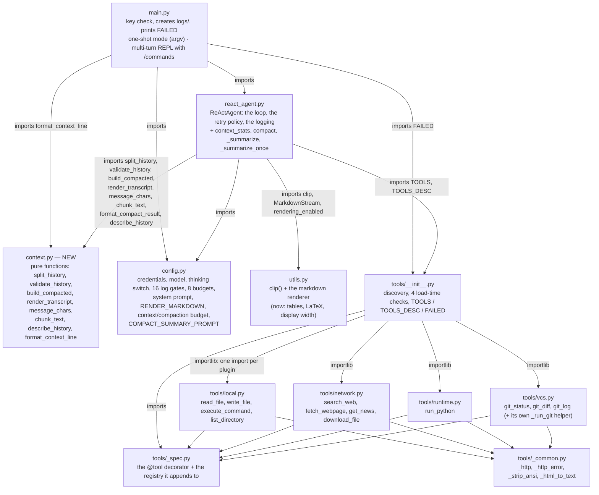
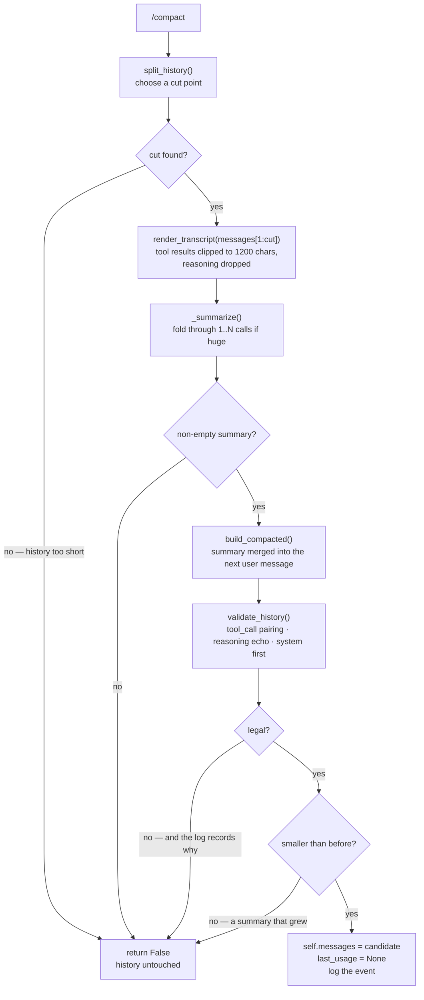

# Multi-Round ReAct Agent with Compaction

The sixth entry in the `mini-agent-system/` series: the same loop, the same retry policy, the same
thinking channel, the same twelve tools and the same conversation as
[`../05-multi-round-agent/`](../05-multi-round-agent/) — and a history that can now be compressed
instead of growing until the context window rejects it.

05 ended with a conversation that is never reset, never trimmed and re-sent in full on every turn.
Its Limitations said so in as many words: *the conversation is unbounded and uncompressible*, and *a
context-limit failure is not recoverable from inside the session*. That is the subject here. The
history is still the conversation — but the older part of it can now be replaced by a summary, on
demand, without leaving the REPL.

| What 05 left open | What 06 does |
| --- | --- |
| Nothing measures how full the context is | Every API call's own `usage` report is kept, and a context line is printed after every turn |
| The history can only grow | `/compact` summarizes the older part and keeps the recent turns verbatim |
| A context-limit `400` costs the session | The history is intact after that error, so `/compact` can rescue the session in place |
| The REPL knows two words, `exit` and `quit` | Four commands: `/compact`, `/context`, `/help`, `/exit`, dispatched before the rollback snapshot |
| The renderer covers a line-based subset — tables fall through as pipes | Tables (block-aware), LaTeX → Unicode, and column arithmetic in terminal columns |

The tools layer is untouched, again: **every file under `tools/` here is byte-for-byte identical to
05's** — all seven of them, verified by `md5sum`, which also makes them byte-for-byte 04's. Compaction
needed nothing from the toolkit. Read 06 as a diff against 05.

The first three rows are the lesson; the last two are what the lesson dragged in. Measuring occupancy
is what forced a decision about where the number comes from, compaction is what forced the
message-shape rules to be written down as code, the commands are what happens when a compression has
to be asked for rather than triggered, and the renderer grew because a conversation is something a
human reads — a summary full of tables is exactly the output 05's line-based renderer mangled.

## Structure

Five modules plus a package, exactly as 05, with one new module between the agent and its helpers:



Three things about that picture are worth stating, because they are what keeps the new module from
turning into a second agent:

- **`context.py` is a leaf that imports nothing at all** — not even `config`. Every budget it uses
  (`keep_turns`, `keep_groups`, `tool_chars`, `reasoning_chars`) is an argument with a default, passed
  in by `react_agent.py`. That is what makes the whole module exercisable offline: no network, no
  agent state, no import-time coupling. The only other file in the series that imports nothing is
  `tools/_spec.py`, and it is 32 lines.
- **`tools/` did not move at all.** Byte-for-byte 05's, which were byte-for-byte 04's. The toolkit has
  now survived two lessons in a row without noticing: 05 grew a conversation, 06 grew compression,
  and neither needed a tool.
- **`main.py` now imports from `context.py` as well as from the agent.** The context *line* is a
  presentation concern and lives next to the code that decides what "70% full" means, but the
  *decision* to compact still belongs to the agent. `main.py` reads a formatted string; it never
  touches `agent.messages`.

### What one compaction does

`compact()` is the whole feature. It never runs from inside `run()` — a compaction is a deliberate
user action, and the reason is in the diagram: it replaces the list the rollback snapshot points into.



Everything left of `self.messages = candidate` can fail, and every failure path returns with the
history exactly as it was. The three refusals at the right are the interesting part, and they are the
subject of ④ below.

## Requirements

- Python 3.x — developed on 3.14.7 (miniconda base)
- `openai` installed (`pip install openai`) — currently 3.17.0, installed globally rather than
  pinned, so version drift is possible.
- An API key for a DeepSeek-compatible endpoint, with a model that supports the thinking channel and
  `stream_options={"include_usage": True}`. The usage report is what every context number in this
  lesson is made of; `REQUEST_USAGE = False` in `config.py` is the one-flag escape hatch for an
  endpoint that rejects the parameter, at the cost of the context line saying "not measured yet".
- The same four optional libraries as 05, imported lazily inside the tool functions that need them:
  `requests` (2.34.2), `bs4` + `lxml` (4.15.0 / 6.1.3), `ddgs` (9.16.0), `feedparser` (6.0.14).
- `readline`, for the interactive mode — wrapped in `try/except ImportError` (`main.py:24-27`).

**Compaction itself adds no dependency at all.** There is no tokenizer, no `tiktoken`, no
`transformers`: token counts come from the API's own report and everything local is counted in
characters. That is a design decision with a cost (see ① and Limitations), not an oversight.

## Setup

`config.py` is 05's plus a context/compaction block, so this table is 05's table plus its new rows:

| Variable | Default |
| --- | --- |
| `DEEPSEEK_API_KEY` | `sk-your-key-here` |
| `DEEPSEEK_BASE_URL` | `https://api.deepseek.com` |
| `DEEPSEEK_MODEL_NAME` | `deepseek-flash` |
| `DEEPSEEK_THINKING` | `enabled` — `"enabled"` or `"disabled"` |
| `DEEPSEEK_CONTEXT_WINDOW` | `1000000` — the window the percentages are computed against |

```bash
export DEEPSEEK_API_KEY=sk-...
```

The program exits immediately if the key is still the placeholder.

`DEEPSEEK_CONTEXT_WINDOW` is the only new environment variable, and the comment above it says what
it is not: it is **how much you are willing to spend in this session**, not the model's ceiling.
Setting it to `200000` is legal and useful — a share only means something against a working budget,
and 70% of a million tokens is 700K, which is already an expensive request. It is also what makes the
thresholds testable without waiting for a real context to fill up:

```bash
DEEPSEEK_CONTEXT_WINDOW=4000 python3 main.py      # watch the context line go ⚠️ then 🔴 in a few turns
```

## Running

Two modes, exactly as 05, decided by whether there is an argument:

```bash
cd 06-multi-round-agent-with-compact

python3 main.py                                  # multi-turn: type, get an answer, type again
python3 main.py 'summarize the files in tmp/'    # one-shot: run once and exit, as in 04
```

The multi-turn mode is a loop with four commands:

```
Multi-turn mode: type your prompt, /help for commands, exit / quit / Ctrl-D to leave.

[1] you > what is in this directory?
--- Round 1 ---
🔧 Action: list_directory({'path': '.'})
👁 Observation: [FILE] main.py
...
📊 Context 8,412 / 1,000,000 (0.8%) · 9 messages
[2] you > and what does the first file do?
...
⚠️  Context 41,880 / 1,000,000 (4.2%) · 23 messages — consider /compact
[3] you > /compact

Compacting the context…
  summarize      messages[1:19] — 18 messages, 62,401 chars
  keep verbatim  messages[19:] — 5 messages, plus the system prompt
  as a transcript 21,338 chars (tool results clipped to 1200 chars each, reasoning to 0)
  summarization call 1/1 (21,338 chars in this chunk)…

✅ Compacted: history 24 → 7 messages (78,204 → 17,662 chars); usage is re-measured on the next round

Summary (3,104 chars, replacing the 18 messages above):
...
The compacted history:
[ 0] system                                 1,024 chars
[ 1] user                                   3,918 chars  ← summary
...
```

- The prompt shows `[N] you > `, where `N` is `agent.turn + 1` — the turn about to start. The turn
  counter is not part of the history, so a compaction does not touch it.
- `/help` prints the four commands; `/context` prints the context line plus the local character count;
  `/compact` prints the whole process above; `/exit` leaves. `exit`, `quit` and Ctrl-D still work.
- **Only a single slash-prefixed word counts as a command.** `/etc/hosts` alone is treated as a
  mistyped command and gets an error; a prompt that merely starts with a slash — `/etc/hosts what is
  in it` — goes to the model.
- The conversation lives in `agent.messages` and nowhere else — compaction changes what is in that
  list, not where it lives. Nothing is persisted, and there is no resume. `logs/` is a debug record,
  not memory.
- After every turn — and after a `/compact` that failed — the context line is printed. It is the only
  feedback loop that tells you when to run the next one.

Run from this directory: `logs/` and `tmp/` are created relative to the working directory. stdout
still depends on where it is going — on a terminal you get live, markdown-rendered output; piped or
redirected you get the raw deltas as they arrive. The narration is otherwise 05's: `--- Round N ---`,
`🔧 Action`, `👁 Observation` (truncated to 200 chars), `[Final]` / `[Done]`.

## How it works

### ① The context number is the API's, not ours

There are two ways to know how full a context is: count the tokens locally with a tokenizer, or ask
the server. This lesson does the second, and the whole design follows from it.

```python
if REQUEST_USAGE:
    request["stream_options"] = {"include_usage": True}     # react_agent.py:519
```

The streamed response then ends with a usage-only payload, which `_consume_stream` already had to
tolerate (`if not chunk.choices: continue` — 05 wrote that line because the final chunk can carry
nothing but usage). `run()` keeps it (`react_agent.py:561`):

```python
if getattr(msg, "usage", None) is not None:
    self.last_usage = msg.usage
```

and `context_stats()` (`react_agent.py:88`) turns it into what the REPL shows. Three consequences
worth knowing before you edit anything here:

- **The number describes the *last request*, not the history.** It is `total_tokens` of one call, so
  it is stale by exactly the messages added since — which is why the context line is printed after a
  turn rather than before it, and why it is honest to call the value "usage" rather than "size".
- **A compaction invalidates it, and the code says so** (`react_agent.py:252`): `self.last_usage =
  None` after the swap, because that measurement described a history that no longer exists. `/context`
  right after a `/compact` prints "not measured yet" until the next request — which is correct
  information, not a bug.
- **Everything local is counted in characters, and is labelled as such.** `message_chars()` is used
  for exactly one decision — "did this compaction actually shrink the history?" — where a character
  count is the honest, free, always-available proxy. The `/context` line prints it too, labelled "a
  local character count, not a token count", so nobody mistakes it for the API's number.

The alternative — a local tokenizer — was rejected for a reason that has nothing to do with effort:
it would be a second, *approximate* token count that disagrees with the server's exact one, and every
threshold in `config.py` would then be a threshold on a number nobody can reproduce. One number,
from the party that enforces the limit, is worth more than two that disagree.

### ② The cut point: a compaction may not split a group

Compaction looks like "delete the old messages and insert a summary", and the only hard part is
choosing where "old" ends. The rule that decides it is 05's message-shape invariant, now enforced by
arithmetic instead of by habit:

> The assistant message is appended **once per round**, carrying all of that round's `tool_calls`;
> then exactly one `role: "tool"` reply per call, in order, carrying the matching `tool_call_id`.

A cut inside one of those groups — an assistant whose tool calls lose their results, or results that
lose the assistant that asked for them — produces a history the API rejects. So legal cut points are
exactly two kinds of index, and `split_history()` (`context.py:112`) only ever returns one of them,
walked as a ladder, cheapest-preserving first:

1. **Keep the last `COMPACT_KEEP_TURNS` (2) whole turns.** A turn boundary is the natural cut: it
   never splits a group, and it keeps the exchange the user is currently in.
2. **Too few turns to drop any: keep the last whole turn only.** Falling straight through to group
   boundaries here would cut *into* the turn being asked about — dropping the user's question while
   keeping the answer.
3. **One long turn (one prompt, thirty rounds): fall back to group boundaries.** This is exactly the
   case that most needs compaction — a single research question that called two hundred tools — and
   turn-based cutting can do nothing about it.

`keep_head=1` is always 1: only the system prompt is protected. Everything after it — including a
summary left by a previous compaction — sits inside the summarized range, so the next summary folds
that one forward instead of losing everything the last one knew. The summarizer's prompt is explicit
about it: *"If the transcript already contains a summary of even earlier work, treat it as
established fact and carry its still-relevant content forward."*

Note what is deliberately **not** a condition: the range does not have to contain a tool group. Cut
points are already restricted to turn and group boundaries, so nothing structural is gained by
requiring one — and requiring it would make a plain multi-turn chat with no tool calls impossible to
compact at all.

### ③ The summary is merged into the next user message, not inserted as one

`build_compacted()` (`context.py:230`) produces

```
messages[:1] + <the following user message, with the summary prepended> + messages[cut:]
```

and that shape is not a style choice. Inserting the summary as its own message runs into two API
rules at once:

- **Two consecutive user messages are rejected** ("does not support successive user or assistant
  messages"), so a standalone summary cannot simply be dropped in front of the kept turns.
- **A mid-history system message is worse than that.** Some servers ignore it — the summary is then
  silently inert and the context was spent for nothing — and others let it replace the real system
  prompt, at which point the agent stops emitting the `Final Answer:` marker that `run()` greps for
  and burns to `MAX_ROUNDS`.

So the summary rides *inside* the next user message, behind a fixed header
(`SUMMARY_HEADER`, `context.py:17`) that says what it is:

```
[Earlier conversation compressed — the summary below replaces everything before this point]

<summary>

---

<the user's actual message>
```

The header is also what makes a compacted history readable afterwards: `describe_history()` marks the
message it appears in with `← summary`, which is how the REPL's post-compaction map shows at a glance
that message 1 is not a real user turn. (The marker sits at the *end* of the line because labels are
padded to a fixed width and CJK glyphs are double-width — a marker inside the padded column would
misalign every line after it.)

Dicts are copied, not aliased, for a reason that only shows up on the failure path: merging writes
into the following user message, and if it wrote into the caller's own dict, a candidate that then
failed validation would leave the *live* history corrupted. Build first, swap last.

### ④ Build first, swap last — and the three ways a compaction is refused

`compact()` (`react_agent.py:180`) constructs a complete candidate history and swaps it in on the last
line, so every failure returns with `self.messages` untouched. Three things can refuse it, and all
three are refusals rather than exceptions:

| Refusal | Why it exists |
| --- | --- |
| **The summary is empty** | `_summarize()` returned nothing usable. There is no candidate to validate — an empty summary would silently delete the history it was supposed to preserve. |
| **The resulting history is illegal** | `validate_history()` found a structural violation. This is the safety net, and it is written as a *checker* rather than trusted to the cut-point logic, because two of its failure modes produce **intermittent** 400s — "it ran once without complaint" is not evidence of anything. |
| **The summary is not smaller** | A summarizer is free to write something longer than what it replaces, and then the compaction has made the context *worse*. The guard compares `message_chars()` before and after and keeps the original if the candidate did not shrink. |

`validate_history()` (`context.py:171`) checks four things, and the second one is the subtle one:

- `messages[0]` is the system message (otherwise `run()`'s `first_turn = not self.messages` would
  reset the session on the next turn);
- **`reasoning_content` was not dropped** from a tool-calling assistant message. The check is written
  as "do *some* carriers have it and others not", because the server sends that channel for the whole
  session or not at all — so a session with thinking disabled produces no false positive, and a
  session with thinking enabled catches a dropped field;
- no orphan `role: "tool"` message;
- every assistant with `tool_calls` is followed by exactly its own results, in order.

All three refusals are logged through the `compact` gate before returning, with the reason and, for
an illegal history, the first violation — so a compaction that quietly did not happen leaves a trace
in `logs/` even though the screen shows one line.

### ⑤ The summarization call is deliberately not `run()`'s call

`_summarize_once()` (`react_agent.py:125`) is a second, much smaller API call, and every difference
from `run()`'s request is intentional:

| `run()`'s request | The summarizer's |
| --- | --- |
| `stream=True`, printed live | `stream=False` — there is nothing for a human to read mid-flight |
| sends `tools=TOOLS_DESC` | no tools: the answer is prose, and the twelve schemas would cost ~1.3K tokens for nothing |
| `extra_body={"thinking": {"type": THINKING}}` | `thinking` **disabled** — a summary needs no reasoning channel |
| no output cap | `max_tokens=COMPACT_SUMMARY_MAX_TOKENS` — the only place in the project that sets one |
| `stream_options` (usage) | none — that parameter is valid only with `stream=True`, and passing it here is a 400 |

`_summarize()` (`react_agent.py:159`) wraps it with the folding loop: the transcript is cut into
`COMPACT_SUMMARY_CHUNK_CHARS` (24,000)-character pieces and summarized one at a time, each call
receiving the previous summary as `previous` and being asked to carry its still-relevant content
forward. The common case is one call; the loop exists so that a transcript that is itself too big for
the window has a defined behaviour instead of a 400. Chunking is by **characters**, not tokens, for
the reason in ① — there is no local tokenizer to chunk by.

One prompt detail earns its keep: the summarizer is told that some tool results say things like
*"Error: The maximum number of tool calls per round is N"* and that those calls **were never
executed**, so they must not be recorded as findings. Without that line, the summarizer faithfully
reports a tool failure that never happened, and the compacted agent then believes it. The N is
interpolated from `MAX_TOOL_CALLS_PER_ROUND` — the prompt is an f-string, so the example is the
message the agent actually writes and cannot drift away from the budget.

### ⑥ The REPL dispatches commands before the rollback snapshot

05 made every turn atomic from the outside with an index snapshot:

```python
start = len(agent.messages)        # main.py:136
try:
    agent.run(prompt)
except KeyboardInterrupt:
    del agent.messages[start:]     # main.py:144
```

A command cannot live inside that block, because `/compact` **rewrites the whole list** and the
rollback is a *slice* into it. In this order:

```python
words = prompt.split()
if words[0] in COMMANDS:           # main.py:123 — before the snapshot, on purpose
    ...
    continue
start = len(agent.messages)        # main.py:136
```

the two interact badly in both directions: if a compaction shrank the history, the rollback would
silently swallow the interrupt (the stale index is past the end); if it grew (a summary can be longer
than some of what it replaced), the rollback would truncate the tail it meant to keep. Dispatching
commands first means a command never overlaps a snapshot, and the comment in the file says exactly
this so the ordering is not "cleaned up" later.

Ctrl-C during a command is caught separately (`main.py:127`):

```python
except KeyboardInterrupt:
    print("\n(command interrupted — history untouched)")
```

`KeyboardInterrupt` derives from `BaseException`, so `compact()`'s `except Exception` around the
summarization call lets it through — the same property 05 relies on to make Ctrl-C usable as a
signal. An interrupt during the network call therefore leaves the history untouched, and the REPL
continues. (An interrupt during the *printing* after the swap would leave the message optimistic —
see Limitations.)

### ⑦ The renderer grew tables, LaTeX and terminal columns

05's renderer was line-based and covered a markdown subset that explicitly excluded tables. A
compaction makes that worse rather than better: summaries are prose *about* structured work, and the
model writes tables into them constantly. Three changes, in `utils.py`:

- **A table is a block, not a line.** You need the separator row to know it is a table at all, and
  every row to know how wide each column is. So `MarkdownStream` holds lines back: a possible header
  waits one line for the `|---|` row that confirms it, and a confirmed table waits for the block to
  end. The cost is that a table appears when its last row arrives instead of row by row; the
  alternative is not rendering it at all.
- **Column arithmetic uses `display_width()`, never `len()`.** CJK glyphs occupy two terminal columns,
  so a table aligned by `len()` looks ragged the moment any cell contains Chinese. ANSI sequences
  count zero, East Asian Wide/Fullwidth count two.
- **LaTeX is converted where a faithful conversion exists** (Greek letters, operators, `^`/`_`
  scripts, `\frac`, `\sqrt`) and otherwise left as readable source. A terminal cannot typeset maths,
  and pretending otherwise would be worse than showing the source.
- **Width pressure wraps, it does not truncate.** A too-wide table gets taller, not less complete —
  an `…` in the middle of a definition answers a different question than the one that was asked.

Two parser details are load-bearing and easy to "simplify" back into bugs: a `|` inside a code span
or a `$…$` math span does **not** separate cells (models write `` `b | a` `` without escaping it, and
splitting there turns one cell into three — measured: a 4-column table of number-theory concepts came
out with 8 columns), and emphasis keeps 05's ASCII-only lookarounds so `他说*很好*啊` still
italicises while `2*3*4` does not.

The invariant from 05 is unchanged: **the raw markdown goes into the history, the API payload and the
log; only the prints a human reads go through the renderer.**

## Thinking mode

Unchanged from 05, and still the default path (`DEEPSEEK_THINKING=enabled`). The short version:

- **The response carries `reasoning_content`, and history must echo it back** — every request sends
  `tools`, so a historical assistant message missing that field is rejected with a `400`.
- **The check is `is not None`, never truthiness.** An empty string is a value the API wants back.
- Compaction is the third place in the series where this rule has to be *checked* rather than
  assumed: `validate_history()` refuses a candidate history in which the reasoning channel has been
  partially dropped, which is exactly what a hand-written "rebuild the messages" would do.

Two compaction-specific notes:

- **The summarizer runs with thinking disabled** regardless of `DEEPSEEK_THINKING`, and its prompt is
  built with `reasoning` excluded from the transcript (`COMPACT_REASONING_CHARS = 0`). A reasoning
  channel is a *work* record, not a finding, and paying for a second thinking pass on text that is
  about to be thrown away buys nothing.
- **A compacted history is still subject to the echo rule.** The summary message carries no
  `reasoning_content` of its own — it is a `user` message, and the rule keys on assistant messages
  carrying `tool_calls`, which the candidate's tail still does.

## Tools

Twelve tools, four plugins, **identical to 05** — which makes them identical to 04's, byte for byte,
comments included: `md5sum` agrees on all seven files. Nothing in this lesson touches them, and that
is worth a sentence of its own: compaction is a story about the *history*, and the toolkit's
independence from it is the payoff of 04's plugin design. Read 04's README for what each tool does
and for the four problems `_common.py` solves.

The rules from 04/05 that still govern edits under `tools/`:

- **The schemas are prompt text.** `description=` and every parameter description ride on every
  request of every turn — and now also affect *when* compaction is needed, since the twelve schemas
  are re-sent with every request.
- **`_common._http` is still the only place `requests`' exceptions become the builtin
  `ConnectionError`** that `RETRIABLE_ERRORS` recognises.
- **The one deliberate timeout inconsistency is still deliberate:** `run_python` and `vcs._run_git`
  catch `TimeoutExpired` and return a string; `execute_command` does not.

## Logging

`logs/deepseek_log_<YYYYmmdd_HHMMSS>.log`, one file per process — one per session. `EXPORT_LOG` and
`EXPORT_LOG_CHOICES` both gate, as always. There are **16 gates**: 05's thirteen plus three.

| New gate | What it records |
| --- | --- |
| `llm-usage` | The raw usage object of every API call: `Usage: prompt=… completion=… total=…` |
| `context` | Occupancy and history size after every round: `Context: round=… messages=… chars=… used=… window=…` |
| `compact` | Every compaction — accepted or refused — with cut point, counts and characters before/after, the budgets used, the summary text, and the resulting history as a message map |

Three things worth knowing when reading a 06 log:

- **`llm-usage` is the raw measurement and `context` is the interpreted one.** They are separate
  gates on purpose: the first is what the server said, the second is what this design made of it
  (including the local character count, which has no server-side counterpart). If you ever need to
  argue with the context line, the evidence is one gate above it.
- **A refused compaction is logged but not applied.** `Compact REJECTED — …` appears with the reason;
  the history it describes is still the live one. This is the only way to see a failure that the
  screen summarized in one line.
- **`Messages at the beginning:` now dumps a history that may contain a summary.** After a
  compaction, that dump is the only record of what the model actually saw, and the `← summary` marker
  exists to make it readable — a compacted history is legitimate, not corruption.

The `openai` SDK's DEBUG bridge is still attached in `__init__`, so raw HTTP traffic — including the
summarization calls — lands in the same file.

## Differences from 05-multi-round-agent

This directory started as a copy of 05. Every file under `tools/` is untouched — byte-for-byte — and
the change is one new module plus edits to the four agent-side files.

### The context

| | 05 | 06 |
| --- | --- | --- |
| Occupancy | unknown | the API's own usage report, kept per call (`last_usage`) |
| Shrinking the history | impossible | `/compact` → summary + recent turns |
| After a context-limit `400` | restart the process | `/compact` and continue |
| Measuring the history locally | nothing | `message_chars()`, for one decision and one display line |
| The summarizer | — | a second, non-streaming, tool-less, thinking-off call with a `max_tokens` |

### The REPL

| | 05 | 06 |
| --- | --- | --- |
| Commands | `exit` / `quit` / `/exit` | `/compact`, `/context`, `/help`, `/exit` — plus the bare words |
| Prompt | `[N] you > ` | unchanged |
| After each turn | nothing | the context line, with ⚠️/🔴 at 70%/85% |
| Command vs. rollback | n/a | commands dispatch *before* the snapshot, and the comment says why |
| A slash-prefixed prompt | goes to the model | a single word is a command error; anything longer still goes to the model |

### Everything else

| File | 05 | 06 |
| --- | --- | --- |
| `tools/` (7 files) | 12 tools, 4 plugins | byte-for-byte identical |
| `context.py` | — | **new**, 320 lines, no imports at all |
| `react_agent.py` | 475 lines | 715 lines — `context_stats`, `compact`, `_summarize`, `_summarize_once`, `_log_section`, usage capture |
| `main.py` | 80 lines, two modes | 148 lines — the four commands and the context line |
| `config.py` | 58 lines, 13 gates, 8 budgets | 106 lines, 16 gates, +10 context/compaction constants, +`COMPACT_SUMMARY_PROMPT` |
| `utils.py` | 130 lines | 647 lines — tables, LaTeX, `display_width` |
| `MAX_TOOL_CALLS_PER_ROUND` | 5 | 10 |
| Loop, retries, message shape, `_consume_stream` | — | unchanged |

Five of those are substantive:

**The number that decides everything comes from outside.** "How full is the context?" has no local
answer worth trusting, and this lesson refuses to invent one. The API reports usage; the config
compares it to a budget *you* set; the REPL shows it after every turn. The character count is kept
strictly for the one question where it is the right tool — "did the compaction shrink anything?" — and
is labelled as characters everywhere it appears.

**The compaction is a transaction, not an edit.** Cut-point selection, candidate construction,
validation, the size guard and the swap are five separate steps, and only the last one mutates
anything. The three refusals (empty, illegal, not smaller) all exist because the alternative is a
history that is subtly wrong — and a wrong history is not a wrong answer, it is a session that fails
on every subsequent turn.

**The message-shape invariant finally has code.** 03–05 documented the "one assistant per round, one
result per call, in order" rule and enforced it by convention at a single append site. Compaction is
the first operation that could violate it *silently*, so the rule became `validate_history()` — a
checker that runs on every candidate, and whose most valuable check (partial `reasoning_content`) is
precisely the failure that produces intermittent 400s rather than immediate ones.

**A compression that must be asked for is a different feature from one that happens.** There is no
automatic threshold trigger anywhere in this code: `run()` never calls `compact()`. The agent
measures, the REPL warns, and the human decides — because a compaction is lossy in a way that only
the person who knows what the session is for can accept. What the code can do is refuse to make it
worse (the size guard) and refuse to make it illegal (the validator).

**The display grew because the content changed.** Tables, LaTeX and CJK column arithmetic are in this
lesson because summaries contain what the model's other prose contains — and 05's line-based renderer
turned a table into a pile of pipes. The renderer's invariant is unchanged: display-only, raw
markdown everywhere else.

Three things got worse, all of them consequences of a lossy operation now existing:

- **A summary is a lie of omission by construction, and nothing checks its content.** The validator
  is structural: it cannot tell a faithful summary from a plausible fabrication. The prompt forbids
  invention; that is a request, not a guarantee.
- **`MAX_TOOL_CALLS_PER_ROUND` doubled to 10**, so a round can put twice as much into the history
  before anything is compacted.
- **The REPL's `(command interrupted — history untouched)` is optimistic** if the interrupt lands
  after the swap, during the post-compaction printing.

Everything else is unchanged: the round loop, `_parse_args`, `_call_tool`, `RETRIABLE_ERRORS` and its
four rules, the `str()` → `raw_len` → `clip()` ordering, the round cap that answers over-cap calls
with a tool result instead of trimming `msg.tool_calls`, the surrogate scrub, the Ctrl-C rollback for
turns, and `self.plan` as an unused placeholder.

## Limitations

This is a teaching example, not a safe or complete agent. Everything in 05's Limitations still holds
— an unsandboxed toolkit, `download_file` writing arbitrary URLs to arbitrary paths, `run_python`
executing model-written code with the agent's own interpreter, `tmp/` accumulating a `.py` per call,
retries that ignore idempotency, no tests — and compaction adds its own:

- **Compaction is manual and you can forget to run it.** There is no automatic trigger at 85%, no
  warning that keeps re-appearing, and a session that ignores the context line still dies of a `400`.
  The intended recovery — `/compact`, then continue — works, but only if the user knows to type it.
- **The recent turns are kept verbatim, so compaction cannot save every session.** If the last two
  turns (or the single long turn, in group-fallback mode) are themselves larger than the window,
  there is nothing to compact that would help, and the "not smaller" guard will refuse. The ladder
  always keeps something; it cannot keep nothing.
- **A summary is unverified prose.** Structure is checked, meaning is not. A summary that drops a
  file path, inverts a decision or invents a result passes every check in `context.py`.
- **The summary prompt is an f-string, so its own text is constrained.** The interpolation is what
  keeps the over-cap example true when the budget moves, and the cost is that a literal `{` typed
  into the prompt would have to be escaped.
- **`(command interrupted — history untouched)` can be wrong.** An interrupt that lands after
  `self.messages = candidate` but during the verbose printing leaves a *changed* history behind a
  message that says nothing changed.
- **The context number is a snapshot of the last request, not a live measurement.** It excludes the
  messages appended since, and after a compaction it is deliberately absent until the next call.
- **`task_text` is the first prompt only.** The summarizer is handed the original request verbatim
  forever, but a later turn's request reaches it only through the transcript — so it can be
  paraphrased away, and there is no `/reset` to start a genuinely new task.
- **`context.py` is written to be unit-testable and has no tests.** Its docstrings reference a
  `_test.py` that substitutes `_summarize_once` to exercise the failure paths offline; that file does
  not exist yet in this repository. (05's `tools/__init__.py` refers to a `_test.py` for the loader
  in the same way.)
- **The renderer extends a subset, it does not become a markdown implementation.** Tables now work,
  but nested lists, setext headings, HTML and footnotes still fall through as plain text, and a
  construct the model splits across lines is still rendered as the lines it arrives in. A table is
  the one block the renderer holds back; everything else is still per-line.
- **`render_markdown()` and `markdown_to_ansi()` are still dead code.** `react_agent.py` imports only
  `clip`, `MarkdownStream` and `rendering_enabled`; the whole-text variant still has no caller. It is
  the second lesson in a row that the streaming path is the only one exercised.
- **`COMPACT.md` is referenced but not in the repository.** The comments cite its §3.4, §4.2,
  §4.3c, §4.3e and §7.1 as the design document behind the budgets and the sampling point.

## Layout

```
main.py            entry point: key check, creates logs/, prints FAILED;
                   one-shot mode (argv) or the multi-turn REPL with /compact,
                   /context, /help, /exit; the context line; the Ctrl-C rollback
react_agent.py     the ReActAgent class: the loop, the retry policy, the turn counter,
                   _consume_stream, _append_assistant_reply, the usage report,
                   context_stats, compact, _summarize / _summarize_once, the logging
context.py         compaction as pure functions: split_history, validate_history,
                   build_compacted, render_transcript, message_chars, chunk_text,
                   describe_history, format_context_line, format_compact_result
utils.py           clip(), plus the display-only markdown renderer
                   (MarkdownStream, tables, latex_to_text, display_width)
config.py          credentials, model, thinking switch, 16 log gates, 8 budgets,
                   the context/compaction budget, system prompt,
                   COMPACT_SUMMARY_PROMPT, RENDER_MARKDOWN
tools/
  __init__.py      the loader: discovery, 4 load-time checks, TOOLS / TOOLS_DESC / FAILED
  _spec.py         the @tool decorator and the registry it appends to
  _common.py       helpers shared by several plugins: _http, _http_error, _strip_ansi, _html_to_text
  local.py         read_file, write_file, execute_command, list_directory
  network.py       search_web, fetch_webpage, get_news, download_file
  runtime.py       run_python
  vcs.py           git_status, git_diff, git_log (+ the private _run_git helper)
```

Indentation is tabs in `react_agent.py`, `config.py`, `main.py`, `utils.py` and `context.py`, and 4
spaces in every file under `tools/` — the same split as 05, and for the same reason: agent-side files
are tab-indented, tool-side files are not. Mixed indentation already exists *within* some tab-indented
files (the `readline` import block and the top-of-file imports in `main.py` are 4-spaced, the body
around them is tabs). Match the file you are editing.
