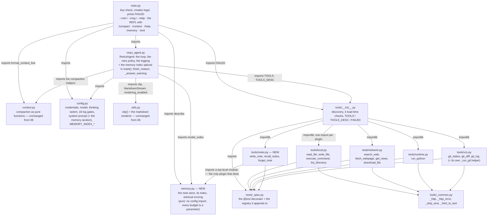
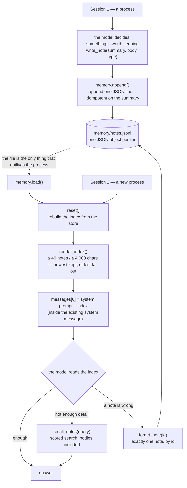

# Multi-Round ReAct Agent with Long-Term Memory

The seventh entry in the `mini-agent-system/` series: the same loop, the same retry policy, the same
thinking channel, the same REPL and the same conversation as
[`../06-multi-round-agent-with-compact/`](../06-multi-round-agent-with-compact/) — and something that
survives the process. Every lesson so far has ended at `exit`, and 05 said so in as many words:
*exit means amnesia*. 06 made the conversation compressible, which manages the history *inside* one
session; nothing in it could put anything back into the next one.

This lesson adds the third kind of memory. Working memory is `messages` — that is 03–06. Short-term is
the same thing scoped to one process. **Long-term memory is new: a store on disk, an index of it in
the system prompt, and three tools that read and write it.** The question it answers is not "how do I
remember more inside a session" but "what does the agent know before this session starts".

| What 06 left open | What 07 does |
| --- | --- |
| Everything the agent learned died with the process | `memory/notes.jsonl` plus `write_note` / `recall_notes` / `forget_note` |
| Nothing told the model what earlier sessions knew | an index of the store is spliced into `messages[0]` at session start |
| A reply the server cut short was indistinguishable from a finished one | `finish_reason` is captured, judged and logged; a bad closing reply prints a warning |
| The workspace root was wherever you happened to type | `--root <dir>`, `--msg <text>`, `--help` — parsed by a pure function, before any side effect |
| The REPL knew `/compact`, `/context`, `/help`, `/exit` | a fifth command, `/memory`, shows the store and what its index costs per request |

The first two rows are the lesson. The other three are what the lesson dragged in: the incident behind
`finish_reason` happened while this lesson was being written (see ⑥); `--root` exists because a memory
store needs a defined home — `memory/` is a relative path, so "where the agent remembers" is exactly
"where you ran it"; and `/memory` exists because a store nobody can inspect is a store nobody trusts.

The tools layer moved for the first time since 04: **one new plugin** (`tools/notes.py`) and the seven
existing files byte-for-byte identical to 06's. The loader needed no change at all — a non-underscore
`.py` file under `tools/` *is* a plugin, which is the payoff of 04's design. Read 07 as a diff against
06.

## Structure

As in 06 — five modules plus a package — with one new leaf module and one new plugin:



Three things about that picture are worth stating:

- **`memory.py` is a leaf that imports nothing from the project** — not `config`, not
  `react_agent`. Every budget it uses (`max_notes`, `max_chars`, `body_chars`, the store path) is an
  argument with a default. That is what lets `_test.py` cover the whole feature with no network and
  no agent state, and it is why the store, the index and the scoring live in a module rather than
  inside the plugin.
- **`tools/notes.py` imports a top-level module** (`memory`), the only place in the series where a
  plugin reaches outside its own package. It is a deliberate exception with a known consequence:
  copy `tools/` somewhere without `memory.py` beside it and `notes` lands in `FAILED` — which is
  exactly what the loader group of `_test.py` does, and why that case asserts the `LOADED` path
  rather than `FAILED == {}`.
- **`main.py` imports `memory` directly, and does not touch the agent's history.** `/memory` is a
  presentation concern: it prints what the store holds and what the index *costs*, and the numbers
  come from `describe()`. Writing and recalling still happen only through tool calls the model makes.

### What one memory does

The whole feature in one picture — note that nothing crosses between the two sessions except the
file:



Everything left of `messages[0]` is deterministic file I/O. The only judgement calls are the model's:
when to write, when to recall, when to delete.

## Requirements

Nothing new. `memory.py` is standard library only (`json`, `os`, `re`, `time`) — **this lesson adds
no dependency**, which is worth saying after a lesson that added a renderer.

- Python 3.x — developed on 3.14.7 (miniconda base)
- `openai` installed (`pip install openai`) — currently 3.17.0, installed globally rather than
  pinned, so version drift is possible.
- An API key for a DeepSeek-compatible endpoint, with a model that supports the thinking channel and
  `stream_options={"include_usage": True}`.
- The same four optional libraries as 05/06, imported lazily inside the tool functions that need
  them: `requests` (2.34.2), `bs4` + `lxml` (4.15.0 / 6.1.3), `ddgs` (9.16.0), `feedparser` (6.0.14).
- `readline`, for the interactive mode — wrapped in `try/except ImportError`.

## Setup

`config.py` is 06's plus three constants and a new section in the system prompt; no new environment
variable, and the credentials table is unchanged:

| Variable | Default |
| --- | --- |
| `DEEPSEEK_API_KEY` | `sk-your-key-here` |
| `DEEPSEEK_BASE_URL` | `https://api.deepseek.com` |
| `DEEPSEEK_MODEL_NAME` | `deepseek-flash` |
| `DEEPSEEK_THINKING` | `enabled` — `"enabled"` or `"disabled"` |
| `DEEPSEEK_CONTEXT_WINDOW` | `1000000` — the window the percentages are computed against |

```bash
export DEEPSEEK_API_KEY=sk-...
```

The three new constants are the index's budget, and they are a *token* budget, not a display
preference — the index sits in the system prompt, so it is paid for on every request of every session:

| Constant | Default | What it caps |
| --- | --- | --- |
| `MEMORY_INDEX_MAX_NOTES` | `40` | how many notes the index may list |
| `MEMORY_INDEX_MAX_CHARS` | `4000` | the whole index block, in characters (≈1K tokens) |
| `MEMORY_INDEX_HEADER` | — | the fixed line that introduces the block in the system prompt |

`memory.py` carries the same two numbers as its own defaults so it can be used standalone; the agent
passes config's values, and `_test.py` 9h asserts the two pairs cannot drift apart.

The store itself is `memory/notes.jsonl`, created on first write. It is a **relative path**, like
`logs/` — so it lands in the working directory, and `--root <dir>` moves it along with everything
else. Running the agent from a different directory starts a different, empty memory; that is the
design (each directory has its own brain), but it is also the first thing to check when the agent
"forgets" something.

## Running

The command line is now `--root <dir>`, `--msg <text>` and `--help`; `--help` needs no API key,
creates no log file and changes nothing:

```bash
cd 07-multi-round-agent-with-memory

python3 main.py --help                                          # usage, options, env vars, real defaults
python3 main.py                                                 # multi-turn REPL
python3 main.py 'list the files here, then say how many'        # one-shot (a bare argument is the prompt)
python3 main.py --root /some/other/folder                       # same REPL, workspace root moved there
python3 main.py --root /some/other/folder --msg 'summarize'     # one-shot against that root
```

`--root` becomes the process's working directory (`os.chdir`), so `logs/`, `memory/` and `tmp/` are
created inside it and every tool path resolves against it. One statement is enough because
`EXPORT_LOG_PATH` and `memory.NOTES_PATH` are relative strings resolved at `open()` time, not
absolute paths frozen at import. `main.py` prints `Workspace root: …` whenever it moves, because
silence would make that a guessing game.

**An argument that is not an option is joined into the prompt**, so the form the rest of the series
uses — `python3 main.py '<prompt>'` — still works. Giving the prompt twice (`--msg` *and* a bare
argument) is an error rather than a guess.

The REPL has five commands:

```
Multi-turn mode: type your prompt, /help for commands, exit / quit / Ctrl-D to leave.

[1] you > do you remember anything about how I like to be answered?
--- Round 1 ---
🔧 Action: recall_notes({'query': 'how the user likes answers'})
👁 Observation: 1 note(s) matched, best first:
[2] (feedback, score 0.60) Answer in Chinese, and lead with the conclusion
    The author reads Chinese; English is fine for code and comments.
...
📊 Context 4,102 / 1,000,000 (0.4%) · 7 messages

[2] you > /memory
3 note(s): feedback 2, project 1
Index: 214 chars (cap 40 notes / 4000 chars) — paid for on every request
Store: /…/07-multi-round-agent-with-memory/memory/notes.jsonl
         214 chars of memory index are in this session's system prompt (a snapshot from when it
         started; notes written since reach the index only in the next process)
```

- `/memory` prints the store's contents, what the index costs per request, and where the file is. The
  last line is the important one: **the index is a snapshot from session start**, so a note written
  ten turns ago is on disk but not in the prompt. Saying that out loud is the point of the command —
  otherwise the two numbers look like a bug.
- The index the model sees is the block from `render_index()`; when the store is empty it is not
  spliced in at all, and a session with an empty store is byte-identical to a 06 session.

## How it works

### ① The boundary that matters is the process, not the context

Three words that get used interchangeably and should not be:

| | In this codebase | Since |
| --- | --- | --- |
| Working memory | `messages` itself — the history the model is shown | 03 |
| Short-term / session memory | the same thing, scoped to one `python3 main.py` | 05 |
| **Long-term memory** | **a store on disk plus retrieval — survives `exit`** | **07** |

The distinguishing question is not "where is it stored" but **"does it survive `exit`"**. By that
test this agent had no long-term memory at all before this lesson — not weak memory, zero: the file
`logs/` written by every run is a *debug record*, and a fresh process reading it back is incidental,
not memory. What makes this lesson's version memory is that the flow is intentional and named: the
model decides to write, the store is a file with a schema, and the next session is told what it
holds.

The design consequence: **memory is not a bigger context window.** If "remembering" meant "more
tokens", this lesson would be a tuning exercise. The work is in the other three questions — when to
write, what to write, and how to find it again.

### ② The index rides inside `messages[0]`

The single most consequential decision in this lesson is *where* the index goes. It could have been
its own message, and that would have been wrong three times over:

```python
# react_agent.py, reset()
content = self.system_prompt
if self.memory_index:
    content += MEMORY_INDEX_HEADER + self.memory_index
self.messages = [{"role": "system", "content": content}]
```

- **A mid-history `system` message is not allowed, and the failure is silent.** 06 learned this the
  hard way with the compaction summary (see its ③): some servers ignore a second system message, so
  the summary is inert and the context was spent for nothing; others let it *replace* the real system
  prompt, at which point the agent stops emitting `Final Answer:` and burns to `MAX_ROUNDS`.
- **As a `user` message it would be summarized away.** `split_history()` summarizes from
  `messages[1]`, so anything after the system prompt is inside the compacted range. The index has to
  be in the one message compaction never touches.
- **`split_history`'s `keep_head=1` protects `messages[0]` only.** Riding inside it means every
  future compaction leaves the index exactly where it is, and the index never enters the rolling
  token budget in the way a separate message would.

The index is rebuilt in `reset()` rather than `__init__` for two reasons: "start a new conversation"
should mean "re-read the store", and `self.system_prompt` stays the untouched base prompt (a `_test.py`
case asserts the index never leaks into it).

Failure to build the index is deliberately **non-fatal but never silent**: an unreadable store must
not make the agent unusable, so the exception is caught, `memory_index_error` is recorded, and the
`memory` log gate writes `FAILED to build the index — …` at session start.

### ③ Two budgets: the index is paid every request, the body on demand

A note has two fields, and they exist to be spent in two different places:

| | `summary` (the index) | `body` (the detail) |
| --- | --- | --- |
| Where it lives | in the system prompt, always | on disk, fetched on demand |
| When it enters the context | **every request** | only when `recall_notes` returns it |
| Cost | fixed, predictable (~4,000 chars max) | on demand, capped per note |
| Read by | the model, before it decides anything | the model, after it decides to look |

The alternative — inject the top-k most relevant note *bodies* into the prompt every turn — was
rejected. It makes the token budget unpredictable, it pays for retrieval the model may not need, and
a bad retriever then misleads continuously instead of once. **Retrieval is a tool, not a prompt
decoration**: the model pays for a lookup when it decides it needs one, and the index is the cheap
part that tells it whether looking is worth it.

That is also why the index carries *ids* (four characters per line) even though it costs tokens: with
`[3]` in front of a line, `forget_note(id=3)` needs no round trip, and deletion by id is the only
deletion there is.

**The failure path the index exists to prevent** is worth walking once: with no index, a fresh session
does not know the store holds anything. Ask it "what do you remember about me?" and the honest
answer — available only if the model thinks to search a store it has not been told about — is
nothing. The index converts "unknown unknowns" into a list.

### ④ Chinese retrieval: `query.split()` is broken

The scoring is the simplest thing that could work — a whole-query substring hit scores 1.0, otherwise
the score is the share of the query's terms the note contains — and the interesting part is what a
"term" is:

```python
def _terms(text: str) -> set:          # memory.py
    text = text.lower()
    terms = {w for w in _LATIN_RE.findall(text) if len(w) > 1}
    for run in _CJK_RE.findall(text):
        if len(run) == 1:
            terms.add(run)
        else:
            terms.update(run[i:i + 2] for i in range(len(run) - 1))
    return terms
```

Chinese is written without spaces, so `query.split()` turns an entire Chinese question into a single
token that matches nothing: the retriever would look broken while being perfectly "correct". Bigrams
are the cheap fix — `作者用中文提问` becomes `作者/者用/用中/中文/文提/提问`, and a note containing
`作者` scores. Latin words of one character are dropped as too common to mean anything.

**This is a heuristic and it is honest about it.** Bigrams miss when a note and a query word the same
fact differently — a note saying `作者用中文`, a query asking `用户说什么语言` have zero overlap. When
nothing matches, `search()` returns the newest `k` notes with `matched=False` rather than an empty
result, because a caller that gets nothing back cannot tell "the store is empty" from "my query was
bad", and the second case is the one a keyword retriever produces most often. `render_recall()`
labels those results as such and tells the model not to force a fit. Vector retrieval is a later
lesson; a keyword retriever is enough to make the criteria meaningful, and unlike embeddings it
exposes the Chinese-tokenization problem instead of hiding it.

### ⑤ Writing is the model's decision; deleting takes an id and nothing else

`write_note` records what the model decides is worth keeping, and the tool description says what that
means in this repository: *"Record what the code, git history and CLAUDE.md do NOT already say: a
local patch that lives outside the repo, a trap that cost time, a preference the user stated."*
Automatic per-turn extraction is the obvious next step and the obvious noise generator — Cursor
removed its Memories feature in 2.1.x, which is the product-level counterexample (see Limitations).

Two smaller decisions follow the same "make the failure boring" instinct:

- **`append()` is idempotent on the summary.** The most common duplicate is the model recording the
  same fact twice in one session, and a store that grows a copy every time it is told the same thing
  stops being an index of what is known and becomes a log of what was said. An exact-summary match
  returns `(False, …)` and writes nothing; `_test.py` 9d pins it.
- **`forget()` takes an id and only an id.** Not a query, not a summary, not a list. That is the
  safety property: the blast radius of a bad call is exactly one note, and there is no argument a
  confused model could pass that would clear several at once. Deleting never renumbers the survivors —
  take id 2 out of `[1, 2, 3]` and 1 and 3 keep their ids, so an id read a moment ago still names the
  same note. The one exception is a store emptied completely: `append()` then starts over at 1,
  because there is nothing left to collide with. That is deliberate (a counter file would be state to
  keep in sync for no gain) and pinned by `_test.py` 9j-2.

There is no edit tool. Correcting a note is `forget_note` followed by `write_note` — two existing
tools, and the model is told to do it that way rather than writing a correction beside the original,
which would leave both in the index for every later session to read.

### ⑥ A cut-off answer is not an answer

The second feature in this lesson is not memory, and it exists because of an incident while this
lesson was being written. A REPL turn returned no answer: the screen showed 4,791 characters of
deliberation and then a 72-character fragment of an answer, cut mid-word, followed by `[Done]`.

`[Done]` was not lying about what it checks. The loop's completion test is "no tool calls", which
means *this round is over*, not *an answer arrived* — and **`finish_reason` was never read**, in this
lesson or in any of 02–06. The only mention in the whole series was `COMPACT.md` describing how
DeepSeek rides the usage count on the final chunk: the code took the usage off that chunk and dropped
the field sitting next to it.

What changed:

- `_consume_stream()` captures `chunk.choices[0].finish_reason` right beside the usage read, and
  `_message_dict()` writes it into both response log gates.
- A new log gate, `llm-finish-reason`, records one `Finish: reason=…` line per round.
- `_answer_warning(content, finish_reason)` — pure, module-level — judges a **closing** reply (one
  with no tool calls) and returns a warning for three shapes: `finish_reason == "length"` (an output
  cap cut the generation); content empty or whitespace-only (every token went to the thinking
  channel); and `"Thought:"` present with no `"Final Answer:"` (the ReAct format was opened and never
  closed — the incident's exact signature).

Tool-calling rounds are exempt on purpose: a round that ends with a bare `Thought: …` and a tool call
is the normal shape, and judging those would fire on most rounds. A reply with neither marker is also
fine — the model answers plain chat without the format, and that is the `[Done]` path by design.

How rare it is, measured before the rule was written: of the 111 closing replies on record across
05/06/07, the `(Thought:, Final Answer:)` combinations occur 60 / 48 / 2 / **1**, and the lone
`(True, False)` is the incident. A separate scan of 466 API rounds — including a 110 MB session —
finds exactly one reply matching "no tool calls, reasoning > 500 chars, content < 200 chars": the
same one. The trigger is rare and server-side; what was worth fixing is that the code had no way to
represent it.

### ⑦ The workspace root is a flag now

06 decided one-shot vs multi-turn by "is there an argument", and had no notion of a workspace root at
all. 07 needs one — `memory/` is relative, so "where the agent remembers" is "where you ran it" — and
the first attempt did it the clever way: guess from "is `argv[0]` an existing directory". That was
removed the same day, because this repository really does have a `story/` directory and
`python3 main.py story` silently became a `chdir` into it.

The replacement is a pure function, `main.parse_args`, which raises `_HelpRequested` for `-h`/`--help`
and `ValueError` for anything malformed (exit code 2, with the usage text):

| Input | Result |
| --- | --- |
| `--root <dir>` / `--root=<dir>` | the workspace root; `os.chdir`'d, then printed |
| `--msg <text>` / `--msg=<text>` | the prompt; its presence means one-shot mode |
| a bare argument | joined into the prompt, so `python3 main.py '<prompt>'` still works |
| the prompt twice (`--msg` *and* bare) | `ValueError` — an error, not a guess |
| `-h` / `--help`, anywhere | the usage text, before the key check and before `chdir` |

Signalling through exceptions is deliberate for a CLI parse: both outcomes have to abort *before* any
side effect — no log file, no `chdir` — and a raised exception cannot be quietly ignored the way a
returned error code can. `--help` is handled before the API-key check because a help screen that
demands a key is unreachable exactly when it is most wanted.

## Thinking mode

Unchanged from 06, and still the default path (`DEEPSEEK_THINKING=enabled`). The short version:

- **The response carries `reasoning_content`, and history must echo it back** — every request sends
  `tools`, so a historical assistant message missing that field is rejected with a `400`. The check
  is `is not None`, never truthiness.
- **The memory index does not touch the echo rule.** It lives in `messages[0]`, which is not an
  assistant message, so no `reasoning_content` handling changes; the index's only interaction with
  history is that compaction leaves `messages[0]` alone.
- **The incident in ⑥ was a thinking-channel failure mode.** The whole completion went to
  `reasoning_content` and the answer channel produced nothing — which is why "empty content" is one
  of the three warning shapes, and why the warning points the reader at the log's `Finish:` line.

## Tools

**Fifteen tools, five plugins.** The seven files that were in 06 are byte-for-byte identical to 06's
— `md5sum` agrees — and `tools/notes.py` (115 lines) is new:

| Tool | Arguments | What it does |
| --- | --- | --- |
| `write_note` | `summary`, `body=""`, `type="project"` | append one note to `memory/notes.jsonl`; idempotent on the summary |
| `recall_notes` | `query`, `k=5` | scored search; returns bodies, or the newest `k` when nothing matches |
| `forget_note` | `id` | delete exactly one note, by the id shown in the index |

Two things about the plugin:

- **It is a thin shell.** Everything model-facing is in the `description=` strings; everything
  testable is in `memory.py`. That split is what lets the feature be covered offline.
- **`notes.py` imports `memory`.** Everything else in `tools/` imports only `_spec` and `_common`;
  this is the one plugin that reaches outside the package, and its docstring says so.

The rules from 04/05/06 that still govern edits under `tools/`:

- **The schemas are prompt text.** The fifteen descriptions and every parameter description ride on
  every request of every turn — and, since the model decides when to recall, they are also the
  retrieval policy. Changing a description changes behaviour.
- **`_common._http` is still the only place `requests`' exceptions become the builtin
  `ConnectionError`** that `RETRIABLE_ERRORS` recognises.
- **The one deliberate timeout inconsistency is still deliberate:** `run_python` and `vcs._run_git`
  catch `TimeoutExpired` and return a string; `execute_command` does not.
- **The memory tools return plain strings on both paths** — a refusal like `No note with id=7;
  nothing was deleted.` is a result, not an exception, because the model can act on it and code
  cannot fix it.

## Logging

`logs/deepseek_log_<YYYYmmdd_HHMMSS>.log`, one file per process. `EXPORT_LOG` and
`EXPORT_LOG_CHOICES` both gate, as always. There are **18 gates**: 06's sixteen plus two.

| New gate | What it records |
| --- | --- |
| `memory` | The index as it was spliced into the system prompt at session start — its size, its cap, and the text itself (or `FAILED to build the index — …`) |
| `llm-finish-reason` | One `Finish: reason=…` line per round, plus a `Finish warning: ⚠ …` line when a closing reply is judged bad |

Three things worth knowing when reading a 07 log:

- **`memory` is the only gate for the index, because the index is inside `messages[0]`.** The
  history dumps show it as an undifferentiated blob of system prompt; this section is what makes it
  readable. `write_note` / `recall_notes` need no gate of their own — their results are tool
  messages, already dumped by `messages-after-tool-execution`.
- **`Finish:` is the server's own reason for ending a generation** (`stop`, `length`, `tool_calls`),
  recorded every round whether or not anything looked wrong. It is the field whose absence made the
  incident undiagnosable: before this lesson, a truncated reply and a complete one were identical in
  the log.
- **`Reasoning:` and `Content:` lengths in the response dump are how you spot the thinking-channel
  failure** — content near zero with reasoning in the thousands is the signature ⑥ describes.

The `openai` SDK's DEBUG bridge is still attached in `__init__`, so raw HTTP traffic lands in the
same file.

## Differences from 06-multi-round-agent-with-compact

This directory started as a copy of 06. Every file under `tools/` except the new plugin is untouched
— byte-for-byte — and the change is one new module, one new plugin, and edits to the four agent-side
files.

### The memory

| | 06 | 07 |
| --- | --- | --- |
| Across processes | nothing survives | `memory/notes.jsonl`, read at session start |
| What the model knows before it acts | the system prompt | the system prompt **plus an index of the store** |
| Retrieval | — | `recall_notes`, scored, on demand |
| Writing | — | `write_note`, on the model's decision, idempotent |
| Deleting | — | `forget_note(id)` — one note, by id, never renumbered |
| Cost model | context only | index paid every request; bodies on demand |

### The answer-completeness fix

| | 06 | 07 |
| --- | --- | --- |
| `finish_reason` | read and dropped | captured, logged every round, judged on closing replies |
| A truncated closing reply | printed with `[Done]` | same, plus a `⚠` warning above it |
| An empty answer channel | printed as nothing | `⚠ empty reply — the whole completion went to the thinking channel` |

### Everything else

| File | 06 | 07 |
| --- | --- | --- |
| `tools/` (7 files) | 12 tools, 4 plugins | byte-for-byte identical |
| `tools/notes.py` | — | **new**, 115 lines, 3 tools |
| `memory.py` | — | **new**, 302 lines, no project imports |
| `react_agent.py` | 716 lines | 836 lines — the index in `reset()`, `finish_reason`, `_answer_warning` |
| `main.py` | 148 lines, argv or REPL | 286 lines — `parse_args`, `--root` / `--msg` / `--help`, `/memory` |
| `config.py` | 108 lines, 16 gates | 127 lines, 18 gates, +3 memory constants, +5 lines of system prompt |
| `context.py`, `utils.py` | 320 / 647 lines | unchanged |
| `_test.py` | (not in the repository) | groups 9 (memory, 10 cases) and 10 (the CLI parser, 11 cases) |
| REPL commands | 4 | 5 — `/memory` joins the four |

Four of those are substantive:

**The persistence boundary is the feature.** Everything else in this lesson is in service of one
sentence: the agent knows something at startup that it was told in an earlier process. The store is
deliberately dumb — a JSONL file, one object per line, hand-editable, append-only in normal use — so
that the interesting parts stay visible: the index, the retrieval, and the model's decisions.

**The index is a prompt-engineering decision, not a storage one.** It could have been a separate
message, a tool the model must call first, or a per-turn injection. Putting it inside `messages[0]`
is what makes it survive compaction for free, cost nothing extra per turn, and never be confused
with conversation.

**Retrieval is deliberately not automatic.** No per-turn top-k injection, no embedding index, no
automatic extraction of "facts" from the transcript. Every one of those would have made the lesson
harder to see and the failure modes quieter. The model asks; the tool answers; the prompt says when
to ask.

**The completeness fix came from a real failure, not from a checklist.** 02–06 never read
`finish_reason`; the field was sitting on a chunk the code already parsed. The lesson is less "add a
feature" than "notice a signal you were already receiving and throwing away" — and the numbers
(one incident in 111 closing replies, one in 466 rounds) are the reason it took this long to notice.

Three things got worse or remain open:

- **The memory store is a new thing to get wrong.** A wrong note is worse than no note: the index
  puts it in front of every future session, and the model is explicitly told to verify before acting
  on it. There is no verification mechanism beyond that sentence.
- **The two systems of record now disagree.** `memory/` holds what the model chose to write; `logs/`
  holds what actually happened. Nothing reconciles them, and a session that ends without writing
  anything leaves its lessons only in the log.
- **`/memory` shows a snapshot that is already stale** the moment a note is written mid-session. The
  command says so; it cannot fix it, because the index is only rebuilt by `reset()`.

Everything else is unchanged: the round loop, `_parse_args`, `_call_tool`, `RETRIABLE_ERRORS` and its
four rules, the `str()` → `raw_len` → `clip()` ordering, the round cap that answers over-cap calls
with a tool result instead of trimming `msg.tool_calls`, compaction in full, the surrogate scrub, the
Ctrl-C rollback, and `self.plan` as an unused placeholder.

## Limitations

This is a teaching example, not a safe or complete agent. Everything in 06's Limitations still holds
— manual compaction, unverified summaries, an unsandboxed toolkit, `run_python` executing
model-written code, `download_file` writing arbitrary URLs to arbitrary paths, `tmp/` accumulating a
`.py` per call, retries that ignore idempotency — and the memory adds its own:

- **The cross-process criteria have not been run end to end.** The design's acceptance criteria are
  three: (A) process A stores a fact, a fresh process B answers from it — by `recall_notes` **or**
  straight from the index, both of which count; (B) with the index capped at one note and three
  written, `recall_notes` finds the note the index pushed out; (C) the negative — with `memory/`
  cleared, B must *fail*. What is verified is the mechanism offline (`_test.py` group 9) and a smoke
  run whose log shows the `Memory:` section with an empty store. **A, B and C all need real API calls
  and have not been run**; the honest reading of this README is "built and unit-tested", not
  "demonstrated".
- **Retrieval is keyword + CJK bigrams.** It misses paraphrase by construction (see ④), and there is
  no reranking, no embeddings, and no query expansion. The fallback — newest `k` with `matched=False`
  — is a consolation prize, not a match.
- **The store has no pruning and no size limit.** Only the index is capped. `load()` reads and parses
  the whole file on every `search`, every `append` and every reset; at tens of notes that is nothing,
  at tens of thousands it is the first thing that will hurt. Nothing removes notes that stopped being
  true.
- **The index is a snapshot, not a live view.** Notes written during a session reach the index only
  in the next process. Within a session the model must use `recall_notes` to see them — which it can,
  but only if it thinks to look.
- **A note is true when it was written and never re-checked.** The system prompt says to verify before
  acting on one; nothing enforces it. A stale note about a file that has moved is indistinguishable
  from a current one.
- **The memory directory is cwd-relative.** Run the agent from elsewhere and it has a different, empty
  memory. `--root` makes this explicit rather than accidental, but nothing warns you when the store
  you expected is not there.
- **`memory/` is not sandboxed, and does not need to be.** `write_note` writes one relative path; the
  model already has `write_file`, which writes anywhere. The store's protection is its schema, not its
  permissions.
- **`MEMORY.md` is referenced but not in the repository.** The code and comments cite it as the design
  record (as 06's cite `COMPACT.md`, which is also absent). The three API criteria above live in its
  §6/§7.
- **No automatic extraction, on purpose.** Cursor removed its Memories feature in 2.1.x after
  automatic extraction produced more noise than value; OpenAI's automatic consolidation is off by
  default with a delay and a pruning window. Both are the version-2 shape of this design, and neither
  belongs in a lesson where the manual flow has not been demonstrated yet.

## Layout

```
main.py            entry point: key check, creates logs/, prints FAILED;
                   parse_args (--root / --msg / --help); one-shot or the REPL with
                   /compact, /context, /help, /memory, /exit; the context line
react_agent.py     the ReActAgent class: the loop, the retry policy, the turn counter,
                   _consume_stream (usage + finish_reason), _message_dict, _answer_warning,
                   the memory index in reset(), context_stats, compact, _summarize*
memory.py          long-term memory as pure functions: load, append, forget, score,
                   search, render_index, render_recall, describe, _terms;
                   the store path and the index budgets as defaults
context.py         compaction as pure functions — unchanged from 06
utils.py           clip(), plus the display-only markdown renderer — unchanged from 06
config.py          credentials, model, thinking switch, 18 log gates, the budgets,
                   system prompt (now with the memory section), COMPACT_SUMMARY_PROMPT,
                   MEMORY_INDEX_MAX_NOTES / MAX_CHARS / HEADER
tools/
  __init__.py      the loader: discovery, 4 load-time checks, TOOLS / TOOLS_DESC / FAILED
  _spec.py         the @tool decorator and the registry it appends to
  _common.py       helpers shared by several plugins: _http, _http_error, _strip_ansi, _html_to_text
  local.py         read_file, write_file, execute_command, list_directory
  network.py       search_web, fetch_webpage, get_news, download_file
  runtime.py       run_python
  vcs.py           git_status, git_diff, git_log (+ the private _run_git helper)
  notes.py         write_note, recall_notes, forget_note — the only plugin importing memory.py
memory/
  notes.jsonl      the store: one JSON object per line, created on the first write
```

Indentation is tabs in `react_agent.py`, `config.py`, `main.py`, `utils.py` and `context.py`, and 4
spaces in `memory.py`, `_test.py` and every file under `tools/` — the same split as 06, with
`memory.py` on the tool side because it is a leaf module like `context.py`. Mixed indentation already
exists *within* some tab-indented files; match the file you are editing.
