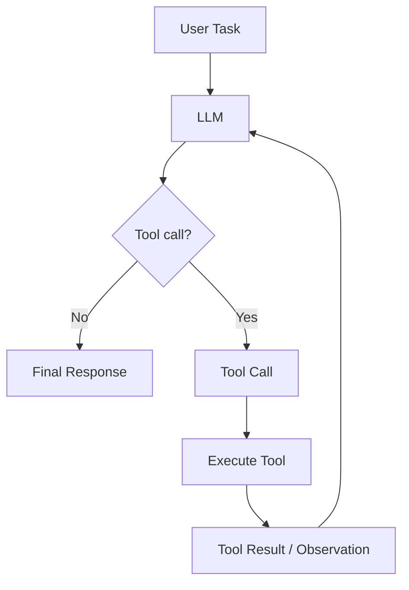
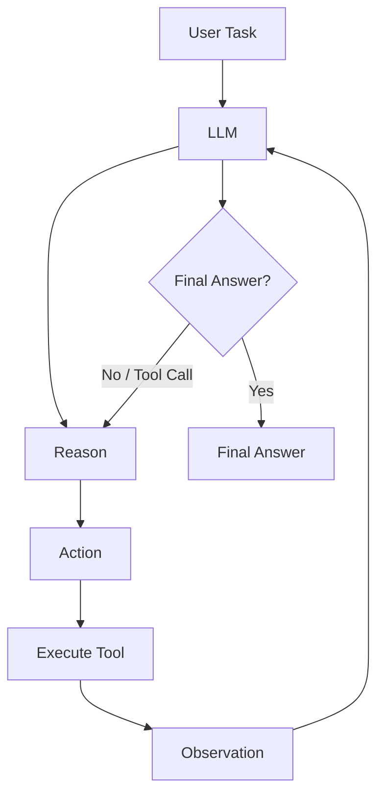

# Mini-Agent-System

Author: Zichen Zhao

## Introduction

This is a series of mini Agent systems evolving from the simplest one to more complicated ones. It demonstrates how to construct an agent system step by step, and how to implement different types of agents and their interactions. The goal is to provide a clear understanding of the principles behind agent-based modeling and simulation.

## Versions

### 01 Bare Agent

[01-bare-agent](01-bare-agent/) demonstrates the simplest agent system, where agents have basic properties and behaviors. It serves as a foundation for understanding how agents operate in isolation.

Generally, a bare LLM follows the following structure:

```python
response = llm.generate_response(input)
```

However, a simple bare agent follows the following structure:



In pseudocode, the bare agent can be represented as follows:

```python
while not finished:

    response = llm(messages)

    if response.tool_call:
        observation = execute(response.tool_call)
        messages.append(observation)
    else:
        return response
```

### 02 ReAct Agent

[02-react-agent](02-react-agent/) introduces a ReAct (Reasoning + Acting) agent that can perceive its environment and make decisions based on its observations. This version showcases how agents can interact with their surroundings and adapt their behavior accordingly.

Here's the structure of a ReAct agent:



The core difference between a bare agent and a ReAct agent is that the ReAct agent can reason about its observations and decide whether to take an action or provide a final answer. This allows for more complex interactions and decision-making processes.