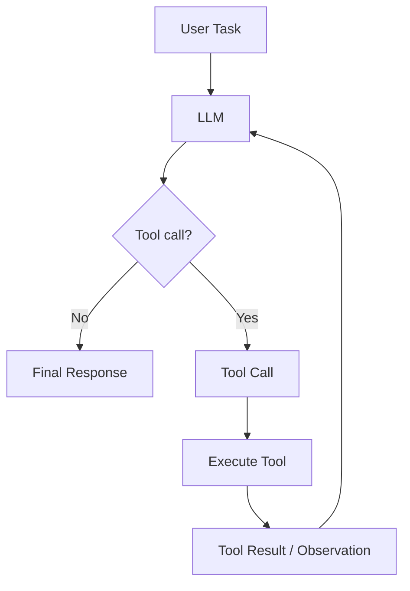
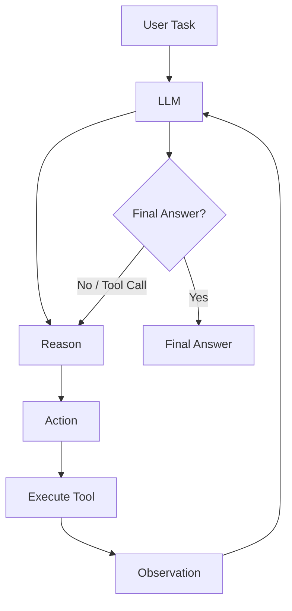
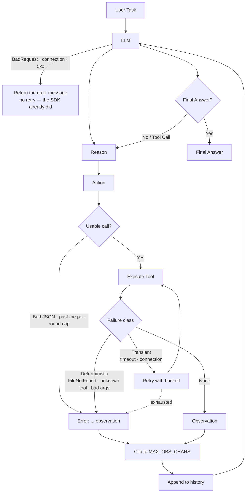
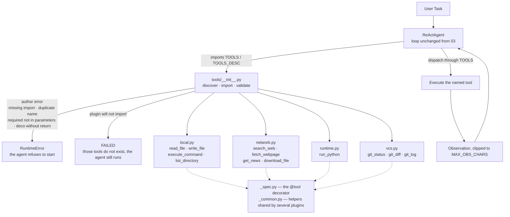
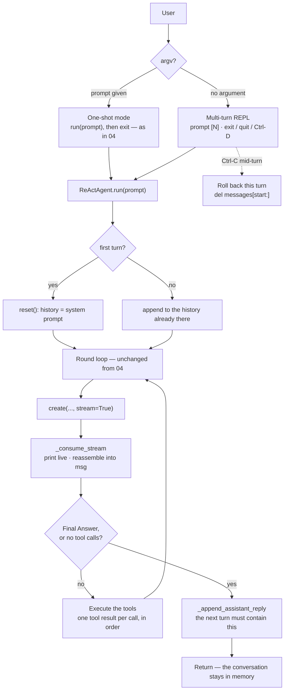

# Mini-Agent-System

Author: Zichen Zhao

## Introduction

This is a series of mini Agent systems evolving from the simplest one to more complicated ones. It demonstrates how to construct an agent system step by step, and how to implement different types of agents and their interactions. The goal is to provide a clear understanding of the principles behind agent-based modeling and simulation.

## Versions

### 01 Bare Agent

[01-bare-agent](01-bare-agent/) demonstrates the simplest agent system, where agents have basic properties and behaviors. It serves as a foundation for understanding how agents operate in isolation.

Generally, a bare LLM follows the following structure:

```python
response = llm.generate_response(input)
```

However, a simple bare agent follows the following structure:


```mermaid
flowchart TD
    U["User Task"] --> LLM["LLM"]

    LLM --> D{"Tool call?"}

    D -- "No" --> F["Final Response"]

    D -- "Yes" --> A["Tool Call"]
    A --> T["Execute Tool"]
    T --> O["Tool Result / Observation"]
    O --> LLM
```

In pseudocode, the bare agent can be represented as follows:

```python
while not finished:

    response = llm(messages)

    if response.tool_call:
        observation = execute(response.tool_call)
        messages.append(observation)
    else:
        return response
```

### 02 ReAct Agent

[02-react-agent](02-react-agent/) introduces a ReAct (Reasoning + Acting) agent that can perceive its environment and make decisions based on its observations. This version showcases how agents can interact with their surroundings and adapt their behavior accordingly.

Here's the structure of a ReAct agent:


```mermaid
flowchart TD
    U["User Task"] --> LLM["LLM"]

    LLM --> R["Reason"]
    R --> A["Action"]

    A --> T["Execute Tool"]
    T --> O["Observation"]

    O --> LLM

    LLM --> F{"Final Answer?"}
    F -- "Yes" --> FA["Final Answer"]
    F -- "No / Tool Call" --> R
```

The core difference between a bare agent and a ReAct agent is that the ReAct agent can reason about its observations and decide whether to take an action or provide a final answer. This allows for more complex interactions and decision-making processes.

### 03 ReAct Agent with Error Handling

[03-react-agent-with-error-handling](03-react-agent-with-error-handling/) adds error handling to the ReAct agent. It is the same three-tool loop as 02; what changes is that every failure now has a route, decided by who can actually fix it — the model, the code, or nobody.

Here's the structure of an error-handling ReAct agent:


```mermaid
flowchart TD
    U["User Task"] --> LLM["LLM"]

    LLM -- "BadRequest · connection · 5xx" --> AE["Return the error message<br/>no retry — the SDK already did"]
    LLM --> R["Reason"]
    R --> A["Action"]

    A --> P{"Usable call?"}

    P -- "Bad JSON · past the per-round cap" --> E["Error: ... observation"]
    P -- "Yes" --> T["Execute Tool"]

    T --> C{"Failure class"}
    C -- "Deterministic<br/>FileNotFound · unknown tool · bad args" --> E
    C -- "Transient<br/>timeout · connection" --> RB["Retry with backoff"]
    RB --> T
    RB -. "exhausted" .-> E
    C -- "None" --> O["Observation"]

    E --> CL["Clip to MAX_OBS_CHARS"]
    O --> CL
    CL --> M["Append to history"]
    M --> LLM

    LLM --> F{"Final Answer?"}
    F -- "Yes" --> FA["Final Answer"]
    F -- "No / Tool Call" --> R
```

In pseudocode, the error-handling ReAct agent can be represented as follows:

```python
while not finished:

    try:
        response = llm(messages)
    except BadRequestError as e:              # our request is invalid — retrying cannot help
        return f"Error: {e}"

    if response.tool_call:
        args, error = parse(response.tool_call)   # syntax and type, one choke point
        if error:
            observation = error                   # deterministic — the model can fix this
        else:
            observation = call_tool(args)         # retries transient failures inside;
                                                  # returns "Error: ..." for the rest
        messages.append(clip(observation))        # bounded before it enters the history
    else:
        return response
```

The core difference between the 02 ReAct agent and the error-handling one is not that it fails less often, but that every failure is routed to whoever can fix it. Deterministic failures go straight back to the model as an observation, transient ones are absorbed by the code with bounded backoff, and a request the API rejects ends the run instead of being retried — so the agent turns failures into feedback instead of stopping on them.

### 04 ReAct Agent with More Tools

[04-react-agent-with-more-tools](04-react-agent-with-more-tools/) grows the toolkit from three tools to twelve. The agent itself is untouched — `react_agent.py`, `config.py` and `utils.py` are byte-for-byte identical to 03's, and the only change outside the tools layer is six lines in `main.py`. What changes is how tools are declared: `tools.py` becomes a `tools/` package in which each plugin carries its own schema next to the function, a single `@tool` decorator is the whole registration, a loader discovers and imports the plugins, and a set of load-time checks turns the mistakes that would otherwise surface only as "this tool is a bit flaky" into a refusal to start.

Here's the structure of a plugin-loaded ReAct agent:


```mermaid
flowchart TD
    U["User Task"] --> RA["ReActAgent<br/>loop unchanged from 03"]

    RA -- "imports TOOLS / TOOLS_DESC" --> L["tools/__init__.py<br/>discover · import · validate"]

    L -- "author error<br/>missing import · duplicate name<br/>required not in parameters · deco without return" --> X["RuntimeError<br/>the agent refuses to start"]
    L -- "plugin will not import" --> FL["FAILED<br/>those tools do not exist, the agent still runs"]

    L --> P1["local.py<br/>read_file · write_file<br/>execute_command · list_directory"]
    L --> P2["network.py<br/>search_web · fetch_webpage<br/>get_news · download_file"]
    L --> P3["runtime.py<br/>run_python"]
    L --> P4["vcs.py<br/>git_status · git_diff · git_log"]

    P1 -.-> S["_spec.py — the @tool decorator<br/>_common.py — helpers shared by several plugins"]
    P2 -.-> S
    P3 -.-> S
    P4 -.-> S

    RA -- "dispatch through TOOLS" --> EX["Execute the named tool"]
    EX --> O["Observation, clipped to MAX_OBS_CHARS"]
    O --> RA
```

In pseudocode, the loader can be represented as follows:

```python
for name in sorted(plugins):                 # every tools/*.py; "_" means shared code, not a plugin
    try:
        import_module(name)                  # runs each @tool decorator, filling one registry
    except Exception as e:
        FAILED[name] = e                     # environment problem — degrade, but record

check_undefined_names()                      # author errors — raise, so the agent refuses to start
check_duplicate_names()
check_declarations()

TOOLS      = {t.name: t.fn for t in registry()}   # dispatch
TOOLS_DESC = [schema(t)    for t in registry()]   # what the model sees
```

The core difference between the 03 and 04 agents is not in the agent at all: the loop, the error routing and the budgets are identical, and only the tools layer changed. 03 asked who can fix a failure at runtime; 04 asks the same question one step earlier. A plugin whose function body references a name that does not exist is deterministic and fixable by editing the file, so the agent refuses to start; a plugin that cannot be imported is an environment problem, so it degrades, is recorded in `FAILED`, and is printed by `main.py`. The payoff is a toolkit that can grow from three tools to twelve — and keep growing — without `react_agent.py` knowing that anything happened.

### 05 Multi-Round ReAct Agent

[05-multi-round-agent](05-multi-round-agent/) turns the one-shot agent into a conversation. The loop, the retry policy, the twelve tools and the plugin loader are unchanged — every file under `tools/` is byte-for-byte identical to 04's — and what changes is that the history is no longer thrown away between runs. `reset()` stops taking a prompt and runs only on the first turn, `run()` appends to the existing messages instead of rebuilding them, and the model's closing reply is written back into the history so the next turn can see what it already answered. `main.py` grows a second mode: with an argument it is 04, without one it is a REPL. Output becomes streaming — the chunks are re-assembled into the exact message shape the rest of the loop already expected — and rendered as markdown when stdout is a terminal.

Here's the structure of a multi-round ReAct agent:


```mermaid
flowchart TD
    U["User"] --> M{"argv?"}

    M -- "prompt given" --> S["One-shot mode<br/>run(prompt), then exit — as in 04"]
    M -- "no argument" --> REPL["Multi-turn REPL<br/>prompt [N] · exit / quit / Ctrl-D"]

    S --> R["ReActAgent.run(prompt)"]
    REPL --> R
    REPL -. "Ctrl-C mid-turn" .-> RB["Roll back this turn<br/>del messages[start:]"]

    R --> H{"first turn?"}
    H -- "yes" --> RS["reset(): history = system prompt"]
    H -- "no" --> AP["append to the history already there"]
    RS --> L
    AP --> L["Round loop — unchanged from 04"]

    L --> ST["create(..., stream=True)"]
    ST --> CS["_consume_stream<br/>print live · reassemble into msg"]

    CS --> T{"Final Answer,<br/>or no tool calls?"}
    T -- "no" --> EX["Execute the tools<br/>one tool result per call, in order"]
    EX --> L
    T -- "yes" --> AR["_append_assistant_reply<br/>the next turn must contain this"]
    AR --> RD["Return — the conversation stays in memory"]
```

In pseudocode, the REPL's turn boundary and the re-assembly can be represented as follows:

```python
while True:                                        # main.py, when there is no argument
    prompt = input(f"[{agent.turn + 1}] you > ")
    if prompt in ("exit", "quit"):
        break

    snapshot = len(agent.messages)                 # a turn is atomic from the outside
    try:
        agent.run(prompt)
    except KeyboardInterrupt:
        del agent.messages[snapshot:]              # a half-written turn is a 400 waiting to happen
```

```python
def run(self, prompt):
    prompt = scrub_surrogates(prompt)              # terminal input can carry invalid UTF-8
    if not self.messages:                          # first turn only — the whole multi-turn change
        self.reset()                               # history = [system prompt]
    self.messages.append({"role": "user", "content": prompt})

    while round < max_rounds:
        stream = create(self.messages, tools=TOOLS_DESC, stream=True)
        msg = consume_stream(stream)               # printed as it arrives; shape is the old one

        if "Final Answer:" in msg.content or not msg.tool_calls:
            self._append_assistant_reply(msg, msg.content)   # keep it — the next turn needs it
            return msg.content

        execute_tools_and_append_one_result_each(msg)        # unchanged from 03
```

The core difference between the 04 and 05 agents is where the state lives. 04's agent was a function of one prompt: it built a history, ran it to an answer, and returned. 05's agent is a function of a conversation: the history *is* the agent, it outlives the call, and every turn appends to it. The rest follows from that — the reply has to be written back because the history must be complete at the end of a turn, the Ctrl-C rollback exists because it must also be complete at every point a keyboard can interrupt it, and a malformed history now costs the session rather than the run. The tools layer, which 04 spent its whole budget on, needed no changes at all — not even a comment.